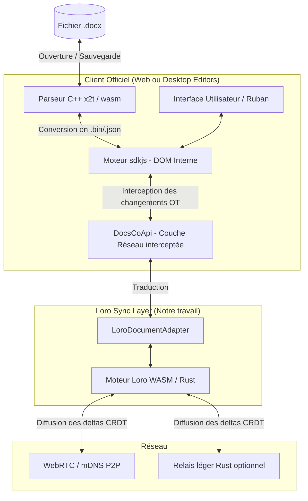
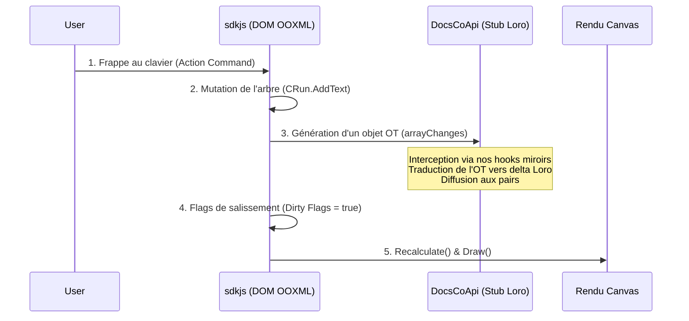
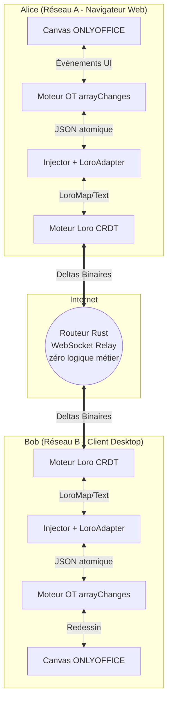
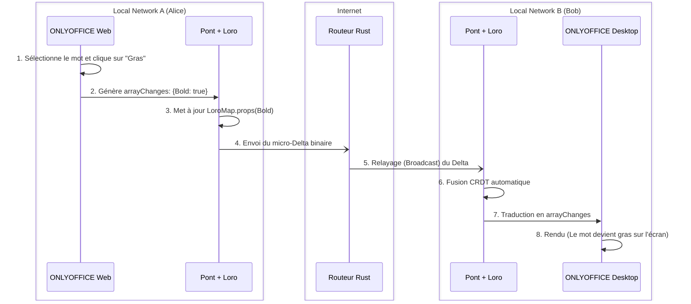
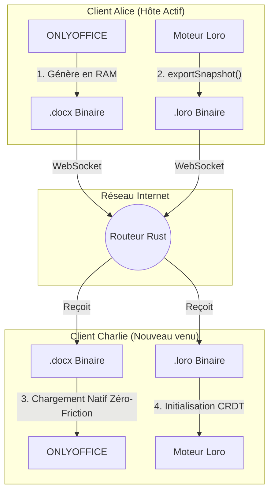
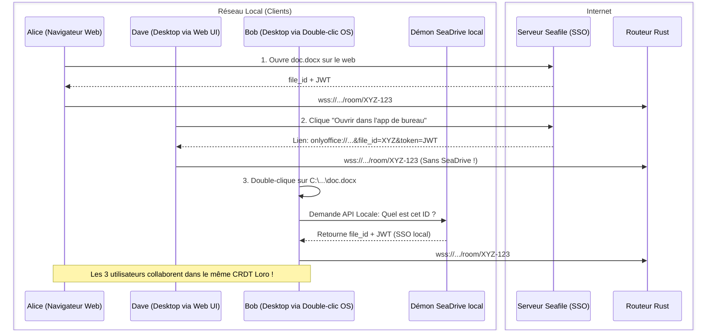

# Architecture : Intégration Loro CRDT × ONLYOFFICE (EuroOffice)

## 1. La Décision Architecturale Fondamentale

**L'objectif :** Obtenir des clients Web et Desktop 100% fonctionnels et hors-ligne, basés sur le moteur de rendu ONLYOFFICE, mais synchronisés via Loro CRDT (P2P) à la place du serveur centralisé classique.

### Le faux problème du parseur `.docx`
Il est important de comprendre que le moteur JS d'ONLYOFFICE (`sdkjs`) **ne parse pas nativement les fichiers `.docx`**. Cette tâche complexe est déléguée à un parseur C++ (`x2t`) qui s'exécute :
- **Sur le serveur** pour la version Web classique (via Document Server).
- **En local** pour la version Desktop (via la librairie native embarquée).
- **Dans le navigateur** via WebAssembly (`core.wasm`) dans certaines déclinaisons.

### La Solution Élégante
**On garde les clients officiels (Web et Desktop) intacts !** 
Ils continueront de gérer l'ouverture, la sauvegarde et l'export PDF du `.docx` avec leurs propres bibliothèques C++ (`x2t` ou `wasm`).
Notre seule intervention consiste à **arracher le "tuyau réseau" (DocsCoApi)** qui les relie normalement au Document Server d'ONLYOFFICE, pour y brancher notre couche de synchronisation **Loro CRDT**.



---

## 2. Pourquoi Loro est le candidat idéal ?

Le choix de Loro CRDT n'est pas anodin face à Yjs ou Automerge. ONLYOFFICE possède un arbre DOM très complexe.

1. **Movable Tree CRDT natif** : Déplacement concurrent de sections/tableaux sans cycles orphelins (le talon d'Achille de Yjs).
2. **Fugue CRDT (Texte riche)** : Les styles (gras, italique) sont gérés de manière fluide, sans entremêlement lors d'insertions concurrentes.
3. **Eg-walker & Lazy Loading** : Chargement quasi instantané (DocState en RAM, OpLog sur disque) limitant la consommation de mémoire (très pertinent pour une application Electron Desktop).
4. **Zéro serveur central requis** : Résolution déterministe hors-ligne (DAG + Horloges logiques Lamport).

---

## 3. Gestion des conflits hors-ligne (Scénario P2P "Dans le train")

Contrairement à Microsoft 365 (Cobalt) qui génère des fichiers de conflit (`_conflit.docx`) et nécessite une résolution manuelle, Loro garantit une fusion mathématiquement prouvée :

| Cas d'usage | Résultat de la fusion Loro |
|---|---|
| **Parties différentes** (90% des cas) | Fusion instantanée et propre. |
| **Même phrase** (Insertions concurrentes) | L'algorithme Fugue juxtapose le texte de manière déterministe. **Jamais de lettres entremêlées.** |
| **Propriété unique** (Couleur de fond) | **Last-Write-Wins** (Dernier qui écrit a raison) basé sur l'horloge logique Lamport. |
| **Déplacement structurel cyclique** | Si Alice bouge A dans B, et Bob bouge B dans A : LoroTree détecte le cycle et l'arbre ne casse jamais. |

### Visualisation des conflits (Track Changes)
Plutôt que d'imposer des fusions silencieuses qui pourraient altérer le sens d'un contrat, nous exploiterons la fonctionnalité **Track Changes** native d'ONLYOFFICE. 
Les deltas Loro reçus après une reconnexion P2P hors-ligne seront injectés comme des "Révisions" (`AddTrackChangeInsert`), permettant à l'utilisateur d'accepter ou rejeter la fusion visuellement.

---

## 4. Comparatif Serveur : Le saut d'échelle (Simplicité et Décentralisation)

En remplaçant le tentaculaire Document Server (Node.js, RabbitMQ, Redis, PostgreSQL) par la magie du CRDT (où l'intelligence est dans le client), le véritable gain n'est pas uniquement sur la RAM par document, mais sur la **suppression radicale de la complexité d'infrastructure** et l'ajout de capacités **Hors-Ligne / P2P**.

| Métrique | ONLYOFFICE Classique (Centralisé) | Relais Rust + Loro (Décentralisé) |
|---|---|---|
| **Rôle du serveur** | Ordonnanceur, Arbitre, Session (Node.js + RabbitMQ) | Simple "Dumb" Relais WebSocket (Broadcaster). |
| **RAM / document actif** | ~13-20 Mo (Rendu client, coordination serveur) | **~1-2 Mo** |
| **RAM pour 100 docs** | ~1.5 - 2 Go | **~150-300 Mo** |
| **Empreinte de base (Stack)** | Lourde (PostgreSQL, Redis, RabbitMQ, Node) | **~15-30 Mo** (Un seul binaire statique Alpine) |
| **Fonctionnement Hors-Ligne** | **Impossible** (Le serveur est le maître) | **Natif** (P2P et Local-First) |


> [!IMPORTANT]
> **Verdict** : Fusionner le moteur de rendu pixel-perfect d'ONLYOFFICE avec le CRDT Loro est **l'approche technique la plus élégante et réaliste** pour une suite bureautique souveraine Local-First. Le gain ne se mesure pas seulement en Mo gagnés, mais dans la **simplification radicale de l'infrastructure** (suppression de Node.js, RabbitMQ, Redis) et l'apport de capacités inédites : **fonctionnement offline natif et collaboration P2P**, impossibles avec le serveur officiel.

> **Rappel sur la performance native d'ONLYOFFICE :**
> *"OnlyOffice is one of the best, if not the best online office integrations for NextCloud, because the rendering of the document editor is done client-side, meaning as a rule of thumb, a server can support 75 connections per gigabyte of RAM. This is impressive compared to Collabora Office, which begins to struggle with connections far before this threshold, with the same level of connections. Also, OnlyOffice provides full compatibility with Microsoft Office document formats, compared to Collabora Office, which is based on LibreOffice Online.*
>
> *Based on OnlyOffice’s recommendations for the paid version of their software (which is identical to the open source version running in single node mode), a server with 4 GB of RAM and 4 CPU cores can easily support 200 to 400 concurrent users. If you need to scale OnlyOffice horizontally beyond two nodes using a load balancer and shared database backend, we provide custom consulting for more than 400 users with the OnlyOffice Community edition."*
> — [Autoize : Building ONLYOFFICE Document Server from source](https://autoize.com/building-onlyoffice-document-server-from-source/)


---


## 5. Synthèse de l'Anatomie de sdkjs & Pipeline de Mutation

Le moteur JS interne reproduit le standard ECMA-376 (OOXML).
Le cycle de vie d'une frappe clavier est le suivant :



Notre hook (déjà initialisé dans la Phase 1.2 avec `Injector.ts`) se situe exactement à l'étape 3. Nous attrapons les changements locaux avant qu'ils ne partent sur le réseau officiel, et nous alimentons notre CRDT pour diffuser l'information.

---

## 6. Structure des fichiers d'interception (Hooks)

Pour éviter de créer un fichier "God class" géant (`interceptor.ts`) qui deviendrait impossible à maintenir, **l'architecture des hooks doit strictement reproduire en miroir l'arborescence originale de sdkjs**. 

Chaque classe interceptée aura son fichier dédié dans notre répertoire `src/hooks/`.

**Exemple d'arborescence :**
```text
loro_sync/src/hooks/
├── word/
│   ├── Editor/
│   │   ├── Paragraph.ts    # Monkey-patch de window.CParagraph
│   │   ├── Run.ts          # Monkey-patch de window.CRun
│   │   └── Table.ts        # Monkey-patch de window.CTable
│   ├── Drawing/
│   │   └── Shape.ts        # Monkey-patch de window.CShape
│   └── document/
│       └── History.ts      # Monkey-patch du Undo/Redo
```
Cette règle garantit que notre code reste lisible, facilement testable de manière unitaire, et immédiatement compréhensible pour un développeur habitué au code source d'ONLYOFFICE.

---

## 7. L'Approche "Industrielle" (DOM-Mirroring Générique)

Pour éviter de devoir coder manuellement la synchronisation des *milliers* de propriétés spécifiques à OOXML (Gras, Italique, Marges, Rotation, Styles de bordure, etc.) qui pourraient changer à chaque mise à jour d'ONLYOFFICE, **notre `LoroDocumentAdapter` utilisera une approche totalement générique basée sur les IDs**.

### Le Registre Plat (Flat Node Registry)
Chaque élément dans `sdkjs` (du paragraphe à la forme vectorielle) possède un identifiant unique généré par le moteur : l'`InternalId`.
Dans le CRDT Loro, nous ne modélisons pas un arbre profond complexe avec des objets personnalisés imbriqués. Nous créons un registre plat couplé à un `LoroTree` :
`const nodes = doc.getMap("nodes");`
`const tree = doc.getTree("dom");`

### La Traduction Automatique et le Déplacement (Move)
*   **Création de nœud** : Lorsqu'un élément est instancié dans ONLYOFFICE, on crée génériquement une `LoroMap` (pour ses propriétés) avec la clé `InternalId`.
*   **Hiérarchie et Déplacement (LoroTree)** : L'arborescence du document (qui est le parent de qui) est gérée par la structure spécialisée `LoroTree`.
    *   Le moteur OT d'ONLYOFFICE n'a pas de commande "Déplacer". Il émet toujours une "Suppression" suivie immédiatement d'une "Insertion".
    *   Notre pont utilise un tampon heuristique (debounce de quelques millisecondes). S'il détecte un *Delete* et un *Insert* du même `InternalId` dans la même rafale de `arrayChanges`, il le traduit en un appel unique et atomique vers le CRDT : `tree.move(InternalId, NouveauParentId)`. Cela protège la sémantique de l'objet et évite sa recréation.
*   **Propriétés (Le secret industriel)** : Au lieu d'intercepter `SetBold()`, `SetRotation()`, etc., nous interceptons les mutations envoyées par ONLYOFFICE. Loro ne se soucie pas de ce qu'est la propriété, il synchronise juste des clés/valeurs JSON.
*   **Texte** : Seules les insertions de caractères appellent de manière spécifique `LoroText.insert()`.

**Avantage décisif (Le zéro-maintenance)** : Si ONLYOFFICE ajoute le support d'une nouvelle ombre 3D dans sa prochaine version, notre code n'aura *absolument pas* besoin d'être mis à jour. Loro synchronisera la nouvelle clé JSON de l'ombre 3D automatiquement.

### L'Élégance de l'interception (`arrayChanges` vs Monkey-Patching)

Lors de la phase de conception initiale, il avait été envisagé de surcharger (*monkey-patcher*) chaque méthode individuelle d'ONLYOFFICE (`SetBold()`, `MergeCells()`, `InsertTable()`, etc.). **Nous avons catégoriquement abandonné cette approche au profit du canal unique `arrayChanges` pour 3 raisons économiques écrasantes :**

1. **Rétro-ingénierie "Black-Box" instantanée** : Trouver la méthode `MergeCells` dans les 40 000 lignes du code legacy de sdkjs prend des heures. Avec `arrayChanges`, il suffit de cliquer sur "Fusionner" dans l'interface pour voir le JSON s'afficher dans la console : `[{"Type": 58, "Id": "cell_1"}]`. L'investigation prend 5 secondes.
2. **Le Volume de Code (1 Hook vs 500 Hooks)** : Intercepter manuellement nécessitait de coder, tester et maintenir des centaines de points d'injection (un par bouton). Avec l'approche actuelle, il y a **un seul point d'injection réseau**. L'extension se limite à un dictionnaire (`switch/case`).
3. **Le Batching (Atomicité gratuite)** : Si un utilisateur colle un énorme tableau, l'éditeur appelle nativement `CreateCell()` 1000 fois. Surcharger cette méthode aurait généré 1000 messages réseau (risque de saturation). Le moteur `arrayChanges`, lui, attend la fin du *Paste* et émet un seul Delta atomique pré-calculé. Le Diff et le Batching nous sont offerts gratuitement !

### 7.1 L'illusion du "Raw Sync" : Pourquoi mapper au lieu de juste transférer ?
Une question légitime serait : *Puisque Loro synchronise du JSON, pourquoi ne pas simplement mettre le tableau brut `arrayChanges` dans une `LoroList` et le laisser se synchroniser ?*
Transférer l'historique brut de l'OT d'ONLYOFFICE via le réseau P2P conduirait à une **corruption immédiate** du document pour 3 raisons :
1.  **Le problème des conflits P2P (OT vs CRDT)** : L'OT d'ONLYOFFICE utilise des coordonnées absolues (ex: "Insère A à l'index 10"). Si Alice et Bob tapent à l'index 10 en même temps hors-ligne, la synchronisation brute écrasera leurs textes. Loro, lui, utilise des identifiants mathématiques relatifs (`LoroText`). En traduisant l'action OT vers l'API `LoroText`, on laisse le moteur mathématique de Loro résoudre le conflit P2P.
2.  **L'asphyxie du Cold Start** : Si nous synchronisions la liste des modifications, un nouvel utilisateur ouvrant le document devrait télécharger des centaines de milliers de deltas `arrayChanges` et forcer le navigateur à les "rejouer" un par un pour reconstituer le document final. Le navigateur crasherait. En mappant vers un Registre Plat (`LoroMap`), Loro maintient l'**état final** en RAM, téléchargeable et affichable instantanément.
3.  **La fusion asynchrone (Mode Avion)** : L'OT centralisé est incapable de fusionner des semaines de modifications hors-ligne massives entre deux utilisateurs. En traduisant vers les structures CRDT (LoroTree), la fusion différée devient mathématiquement parfaite.

### 7.2 Le Pont "Passe-Plat" (arrayChanges ↔ Loro)
Le système repose sur la traduction simultanée entre l'OT centralisé (ONLYOFFICE) et le CRDT décentralisé (Loro) via l'`InternalId` comme "plaque d'immatriculation" :

1. **Aller (Local vers Réseau P2P)** :
   - ONLYOFFICE calcule le delta via son système OT (`arrayChanges`). Ex: `[ { "Type": 14, "Id": "run_456", "Props": {"Bold": true} } ]`.
   - L'`Injector` intercepte ce tableau ultra-précis.
   - Le pont lit l'`Id` (`run_456`), retrouve la `LoroMap` correspondante dans le registre plat, et applique la modification.
   - Loro calcule mathématiquement la résolution de conflit (CRDT) et diffuse un micro-Delta binaire sur le réseau.
2. **Retour (Réseau P2P vers Local)** :
   - Le Loro distant reçoit le Delta et déclenche un événement `subscribe()`.
   - Le pont traduit l'événement Loro (ex: `"run_456" a vu "Bold" passer à true`) en recréant un faux objet `arrayChanges`.
   - Cet objet est injecté dans le moteur de rendu d'ONLYOFFICE qui l'ingère naturellement pour dessiner l'écran.

Cette double architecture permet d'avoir la robustesse de l'affichage d'ONLYOFFICE tout en bénéficiant de la magie hors-ligne et P2P du CRDT.

### 7.3 L'Exhaustivité Algorithmique : Le Générateur de Mapper
ONLYOFFICE possède près de **1250 "Codes Magiques"** distincts d'Action OT (appelés `Types` dans l'arrayChanges), encapsulant chaque action possible : de l'insertion d'une simple puce de liste à la redéfinition d'un axe 3D sur un graphique de surface.
Écrire un `switch/case` manuel pour 1250 types serait à la fois fastidieux, source d'erreurs, et instable face aux futures mises à jour du moteur.

Pour garantir une exhaustivité mathématique absolue, l'architecture Loro-ONLYOFFICE repose sur un générateur dynamique (`scripts/generate_mapper.js`) :
1. **La Source de Vérité Unique** : Le générateur parse directement le fichier natif d'ONLYOFFICE `common/HistoryCommon.js`, qui contient 100% de la structure de l'historique du moteur (Document, Tableur, et Présentation).
2. **Le Décodage Bitwise** : Il résout les opérations binaires (`<< 16` et `|`) utilisées par l'équipe d'Ascensio System pour chiffrer l'ID de la classe et l'ID de l'action en un seul entier décimal.
3. **Le Mapping Dynamique** : Il compile un dictionnaire TypeScript (`OoxmlActionDictionary`) injecté au moment du build. Ainsi, lorsque le pont intercepte un ID mystérieux (ex: `1835009`), le dictionnaire l'associe instantanément à sa chaîne canonique (ex: `"ParaRun_AddItem"`), permettant au pont de traiter 100% du spectre applicatif OOXML avec un seul algorithme générique d'assignation de propriété.

### 7.4 Gestion du Undo / Redo (Time-Travel Local)
Un défi majeur de la co-édition Temps Réel est la fonction "Annuler" (Ctrl+Z). Si Alice et Bob tapent dans le même paragraphe, et qu'Alice fait Ctrl+Z, le moteur natif d'ONLYOFFICE (pensé pour être centralisé) risque d'effacer les caractères que Bob vient de taper.
Pour résoudre cela, **nous désactivons le gestionnaire d'historique natif d'ONLYOFFICE**.
À la place, nous interceptons les événements clavier Ctrl+Z / Ctrl+Y (ou les clics sur les boutons de la barre d'outils) et nous les redirigeons vers l'API **Time-Travel de Loro** (`loro.undo()` / `loro.redo()`).
Loro étant un CRDT, son moteur d'Undo mathématique isole parfaitement les causalités : il va annuler exclusivement les frappes générées par le `peer_id` local d'Alice, sans jamais toucher aux caractères insérés par Bob au même endroit, garantissant une intégrité absolue.

---

## 8. Topologie Réseau et Cas d'Usage (Web vs Desktop)

Voici l'architecture globale en condition réelle : **Alice** utilise l'application Web d'EuroOffice depuis le réseau A, tandis que **Bob** travaille sur l'application native Desktop (Windows/Linux/Mac) depuis le réseau B. Ils collaborent sur le même document via Internet.

### Diagramme de Composants



> **Note :** Les deux clients, bien que sur des plateformes différentes (Web vs Desktop), exécutent exactement la même couche JavaScript/WASM pour `sdkjs` et Loro. Le routeur central ne comprend rien au format Word, il se contente de relayer aveuglément les deltas binaires Loro d'un réseau à l'autre.

### Diagramme de Séquence (Alice tape un mot)



### Le Rôle du Serveur Rust : Un Relais Éphémère (Edge Cache)
Une question légitime se pose : le serveur Rust archive-t-il l'historique des modifications (par exemple, si Alice travaille seule pendant 2 jours) ? 
**La réponse est non. Le routeur Rust n'a pas de base de données et n'écrit jamais sur le disque dur.** Il fonctionne principalement comme un bureau de poste (Pub/Sub) pour relayer les deltas binaires Loro entre les connexions WebSocket.
Cependant, pour résoudre le problème spécifique des **micro-coupures réseau** (expliqué en Section 10), le routeur utilise sa mémoire vive (RAM) comme un **Stateful Edge Cache**. Il conserve en RAM une copie éphémère du dernier Jumeau (`.docx` + `.loro`) envoyé par les clients actifs. Ce cache s'autodétruit au bout de 15 minutes d'inactivité. Il n'est donc jamais une source de vérité à long terme, ce rôle étant strictement réservé à Seafile.

**Comment s'effectue le rattrapage (Catch-up) d'un utilisateur déconnecté ?**
Le travail lourd est effectué par le protocole de synchronisation (Sync Protocol) à l'intérieur des navigateurs :
1. **La Poignée de main (Handshake)** : Quand Bob se connecte, son navigateur envoie un "Vecteur d'État" (*Sync Step 1*) au serveur Rust. Ce vecteur dit : *"Mon horloge interne est à l'état X"*. Le routeur relaye simplement ce message vocal à Alice.
2. **L'Intelligence est Côté Client** : Le moteur Loro dans le navigateur d'Alice reçoit ce message. Il calcule localement la différence : *"Bob est à l'état X, ma version actuelle est à Y. Il lui manque exactement 2 jours de deltas."*
3. **Le Transfert Jumeau** : Le navigateur d'Alice génère le fichier `.docx` à jour en RAM, prend une empreinte Loro atomique, et envoie ces deux fichiers jumeaux à Bob via le routeur.
4. **La Fusion Visuelle** : L'éditeur de Bob détruit son état local périmé, charge nativement le nouveau `.docx` envoyé par Alice, et initialise son Loro avec l'empreinte mathématique correspondante. L'écran de Bob est instantanément à jour sans avoir à rejouer le moindre delta !

Cette architecture P2P soulage totalement le serveur central. Le routeur Rust ne consomme presque aucune RAM ni espace disque, permettant d'héberger des milliers d'utilisateurs sur une infrastructure à coût dérisoire.

---

## 9. Gestion des Objets Binaires (Images, DrawingML)

Les fichiers binaires lourds (images de 5 Mo, graphiques Excel intégrés) ne doivent **jamais** être stockés dans le CRDT Loro pour éviter d'exploser la RAM des clients (l'historique CRDT est immortel).

1. **Interception HTTP** : L'upload d'image (requête POST) généré par ONLYOFFICE est intercepté.
2. **Blob Store P2P** : Le fichier est envoyé à notre Routeur Rust (qui agit comme un serveur de fichiers statiques miniature).
3. **Ancrage Loro** : Le routeur renvoie un Hash/URL (ex: `blob:sha256:abc123`). Ce Hash est injecté dans le CRDT.
4. **Récupération** : Les autres pairs téléchargent l'image depuis le routeur de manière asynchrone pour l'afficher sur leur Canvas.
5. **Lazy Loading et Frustum Culling (Optimisation VRAM)** : Pour éviter le crash mémoire (OOM) sur les documents contenant des centaines d'images, notre pont intercepte la méthode `CImageDrawing.prototype.Draw`. L'image n'est téléchargée et décodée (`createImageBitmap`) **que** lorsque sa boîte englobante croise le viewport (l'écran visible) de l'utilisateur. Si l'image sort de l'écran, son buffer GPU est libéré (`bitmap.close()`).

Pour les clients Desktop, les chemins locaux (`file:///C:/temp/...`) sont de la même manière interceptés, uploadés en arrière-plan, puis remplacés par les URLs publiques avant d'être inscrits dans Loro.

---

## 10. Les 4 Limites et Défis de l'Architecture "Passe-Plat"

Malgré sa rapidité et son ingénierie générique, cette méthode de traduction OT ↔ CRDT soulève 4 défis techniques majeurs que nous devrons contourner.

### Limite 1 : Le "Cold Start" d'un nouvel arrivant (Rejoindre une session active)

*   **Le scénario du pire** : Charlie rejoint la session d'Alice (active depuis 2 jours). Si Charlie ne reçoit que le `.docx` de Seafile (qui a 2 jours de retard), son éditeur n'est pas à jour. Si on lui envoie l'historique CRDT Loro pour rattraper, il devrait rejouer 50 000 événements `arrayChanges`, ce qui ferait crasher son navigateur. Enfin, nous refusons de reconstruire l'arbre JSON manuellement car cela nécessiterait de coder les 451 classes d'ONLYOFFICE.

*   **La Solution retenue (Le "State Transfer" P2P natif)** :
    Plutôt que d'essayer de traduire le CRDT en JSON, nous utilisons le moteur d'ONLYOFFICE d'Alice (l'hôte) pour faire le travail de sérialisation parfaite.
    1. **Étape 1 - La Demande (Réseau)** : Charlie se connecte au routeur Rust. Il signale qu'il est nouveau dans le salon.
    2. **Étape 2 - L'Export en RAM par l'Hôte (Alice)** : Le navigateur d'Alice entend Charlie. Le pont JavaScript d'Alice demande secrètement à son éditeur ONLYOFFICE de générer le fichier `.docx` actuel en mémoire vive (RAM), sans l'envoyer à Seafile.
    3. **Étape 3 - Le Transfert Jumeau** : Alice envoie à Charlie (via le routeur) **DEUX fichiers binaires** : Le `.docx` généré en RAM (le Snapshot visuel parfait) ET le `.loro` (l'état mathématique du CRDT).
    4. **Étape 4 - L'Ingestion Native (Charlie)** : Le navigateur de Charlie donne le `.docx` au moteur C++ d'ONLYOFFICE (qui s'ouvre instantanément, de façon 100% native et exhaustive). En parallèle, il charge le `.loro` dans son moteur CRDT. Charlie est désormais un clone parfait d'Alice, prêt pour le Temps Réel, sans jamais avoir écrit une seule ligne de JSON !



#### Résilience et Performances du State Transfer P2P
Ce mécanisme soulève des questions légitimes sur la charge portée par l'Hôte (Alice), mais l'architecture P2P y répond nativement :

1. **L'Hôte va-t-il lagger ? (Performances WebWorker)**
   Non. Le moteur ONLYOFFICE (AscDFH) exécute la compilation du fichier `.docx` via WebAssembly (WASM) en tâche de fond (Web Worker). La génération prend entre 100 et 300 ms. L'interface d'Alice ne figera pas pendant ce processus. Le binaire est ensuite transmis silencieusement au pont Loro.

2. **Équilibrage de charge (Le rôle du "Parrain")**
   Dans cette architecture, le réseau est totalement égalitaire. Si 10 personnes sont connectées, les 10 navigateurs possèdent l'intégralité du document en RAM. Lorsqu'un 11ème arrivant se connecte, le routeur Rust (qui connaît la liste des pairs actifs) désigne aléatoirement **un "Parrain" (Sponsor)** parmi les 10 présents. Ce mécanisme évite qu'un seul ordinateur supporte la charge d'accueillir tous les nouveaux arrivants.

3. **Auto-cicatrisation et Micro-Coupures (Le Cache Périphérique / Edge Cache)**
   Que se passe-t-il si Alice perd sa connexion Wi-Fi ?
   * **Cas A (Plusieurs pairs actifs)** : Le réseau P2P est "Self-Healing". Si Bob est présent, le routeur l'élit instantanément comme nouveau Parrain. Au retour d'Alice, elle envoie son Vector Clock et Bob lui transmet uniquement les deltas manqués. L'écran d'Alice se met à jour instantanément.
   * **Cas B (Le "Cygne Noir" : Alice est seule et subit une micro-coupure à la seconde où Bob se connecte)** : Si Alice est l'unique hôte, la coupure réseau supprime le salon d'Internet.
   * **Pourquoi nous écartons le "File Lock" Seafile** : Une solution classique consisterait à utiliser un verrou Seafile pour bloquer Bob ("Alice édite, patientez"). Cependant, cela pose de graves problèmes d'UX si le PC d'Alice a définitivement crashé (Bob resterait bloqué indéfiniment ou nécessiterait un bouton "Forcer l'édition" complexe).
   * **La Vraie Solution (Le Cache "Zombie" en RAM du Routeur)** : Nous utilisons une approche de *Stateful Edge Cache*. Toutes les 60 secondes, le client d'Alice pousse discrètement le Jumeau Complet (`.docx` + `.loro`) dans la mémoire vive (RAM) du routeur Rust. Si Alice crashe, le routeur garde ce cache actif pendant un "Grace Period" de 15 minutes. 
   * **La Résolution** : Lorsque Bob arrive, le routeur agit comme un Parrain fantôme : il lui sert le Jumeau depuis sa RAM. Bob commence à éditer avec un retard maximum de 60 secondes sur le travail d'Alice. Lorsque la connexion d'Alice revient, son arbre Loro et celui de Bob partagent toujours le même Ancêtre Commun (Common Ancestor). La fusion mathématique s'opère magiquement !
   * **Pourquoi en RAM et pas sur Disque ?** : Nous interdisons au Routeur Rust de sauvegarder ces Jumeaux sur son propre disque dur (SSD). Garder les données en RAM garantit qu'elles s'évaporent à la fin du Grace Period. Cela empêche le routeur de devenir une base de données concurrente à Seafile (évitant le *Two-Master Problem*), et préserve les disques d'une usure prématurée causée par les écritures massives en arrière-plan (I/O Thrashing).

4. **Garantie d'Atomicité (Frappes pendant la génération)**
   Que se passe-t-il si Alice tape "XYZ" *pendant* les 300 millisecondes où ONLYOFFICE compile le `.docx` pour Bob ? Bob ne va-t-il pas recevoir un fichier périmé ?
   * **La solution (Synchronisation des Horloges)** : Au moment exact où Alice lance la compilation, le pont "gèle" l'état de Loro et prend une empreinte (`snapshot_V100`).
   * Alice envoie à Bob ce `.docx` (V100) et ce `.loro` (V100). Les deux fichiers sont donc des **jumeaux parfaits**. Bob s'initialise avec une base parfaitement cohérente.
   * *Mais où est passé "XYZ" ?* Il n'est pas perdu ! Pendant les 300ms, "XYZ" a été envoyé sur le réseau de manière standard. Dès que Bob finit de charger son jumeau V100, son pont écoute le réseau et applique automatiquement le rattrapage. "XYZ" s'ajoutera sur l'écran de Bob une fraction de seconde après l'ouverture.

### Limite 2 : Le Phénomène d'Écho (Boucle infinie)
*   **Le problème** : Lorsqu'on applique un Delta entrant chez Bob (via `arrayChanges`), le moteur ONLYOFFICE de Bob réagit en générant lui-même un nouvel `arrayChanges` sortant (pour prévenir le réseau que son écran a changé). S'il est relayé, cela crée une boucle infinie de modifications.
*   **La Solution retenue (Le Mutation Guard)** :
    Nous devons implémenter un verrou (lock) asynchrone dans notre intercepteur (`Injector.ts`).
    1. Définir un flag global `isApplyingRemoteUpdate = false`.
    2. À la réception d'un Delta réseau : on passe le flag à `true`.
    3. On injecte le `arrayChanges` dans le moteur natif.
    4. L'intercepteur de ONLYOFFICE s'active et tente de faire un `saveChanges(arrayChanges)`.
    5. **Le Verrou** : Dans notre hook `saveChanges`, on ajoute la condition `if (isApplyingRemoteUpdate) return;`. La modification n'est donc pas renvoyée au réseau.
    6. Une fois le rendu terminé, on repasse le flag à `false`. L'écho est bloqué.

### Limite 3 : La perte de l'intention sémantique (Fusions complexes)
*   **Le problème** : L'OT d'ONLYOFFICE fragmente des opérations complexes (ex: fusionner deux cellules d'un tableau) en opérations de très bas niveau (déplacement de texte, suppression de bordure, etc.). Si un conflit P2P survient pendant cette opération, Loro pourrait entrelacer ces briques avec l'action d'un autre utilisateur, aboutissant à un tableau graphiquement corrompu.
*   **La Solution retenue (L'Approche Transactionnelle)** :
    Loro possède une fonction native de transactions (`doc.commit()`).
    Heureusement, ONLYOFFICE groupe toutes les micro-opérations d'une action utilisateur (comme "Fusionner") dans un seul et même tableau `arrayChanges`.
    Au lieu d'appliquer chaque élément de l'array isolément dans Loro, le pont ouvrira une Transaction Loro, appliquera toutes les modifications de l'array, puis fera un `commit()`. Ainsi, Loro traitera la fusion de cellules comme un **bloc atomique indivisible**, interdisant toute corruption de l'intention structurelle en cas de conflit.

### Limite 4 : La dépendance au protocole privé (Reverse-Engineering)
*   **Le problème** : L'objet `arrayChanges` n'est pas une API publique. ONLYOFFICE peut modifier sa structure de manière arbitraire (ex: renommer le code `Type: 14` en `Action: "Format"`) dans une future version, ce qui casserait instantanément notre pont.
*   **La Solution retenue (Le Fork et l'Isolation du Mapper)** :
    1. **Version Pinning** : Nous figeons la version de `sdkjs` (ex: `v8.1.0`) dans notre dépôt. Pas de mise à jour automatique.
    2. **Design Pattern Adapter** : Nous allons isoler TOUTE la logique de traduction des codes magiques (comme `Type: 14`) dans un seul fichier : `ArrayChangesMapper.ts`. 
    3. **Tests E2E Playwright** : Une suite de tests cliquera automatiquement sur les boutons de l'UI d'ONLYOFFICE (Gras, Insérer Tableau) et vérifiera que le `Mapper` génère la bonne structure Loro. Lors d'une montée de version d'ONLYOFFICE, si la syntaxe `arrayChanges` change, les tests exploseront instantanément, et il suffira de corriger cet unique fichier `Mapper` sans toucher au reste de l'architecture.

### Limite 5 : La Priorité Fichier vs Réseau (Cas du double-clic Desktop / Seafile)
*   **Le problème** : Si Bob double-clique sur un fichier `.docx` synchronisé par Seafile sur son bureau, l'application ONLYOFFICE Desktop charge d'abord le fichier local. Mais si Alice est *déjà* en train de modifier ce même document en ligne, comment le client de Bob le sait-il ? S'il injecte naïvement son `.docx` local dans son Loro, il va créer des doublons avec le document d'Alice (chaque paragraphe aura un ID différent dans les deux Loro).
*   **La Solution retenue (Le Handshake Réseau d'abord)** :
    L'architecture doit imposer une priorité stricte au démarrage :
    1. Bob ouvre le fichier. Le Canvas d'ONLYOFFICE affiche le `.docx` local.
    2. En tâche de fond, le pont de Bob contacte le Routeur Rust (avec un Room ID basé sur le hash du fichier).
    3. **Scénario A (Bob est seul)** : Le routeur répond "Salle vide". Le pont de Bob prend alors le `.docx` affiché à l'écran, génère la structure Loro initiale (de ONLYOFFICE vers Loro) et devient la "graine" (le *Seeder*) pour le réseau.
    4. **Scénario B (Alice est déjà là)** : Le routeur répond "Salle active" et signale à Alice d'envoyer l'état actuel. Alice génère et envoie les Jumeaux Atomiques (`.docx` + `.loro`). Le pont de Bob **détruit** immédiatement l'état Loro et le Canvas local, charge le nouveau `.docx` d'Alice, et le document à l'écran se met à jour magiquement avec les dernières frappes d'Alice.

---

## 11. Résilience et Partition Réseau (Le Scénario de l'Avion)

L'un des avantages majeurs de l'architecture CRDT (comparé à l'OT centralisé d'ONLYOFFICE ou de Google Docs) est sa capacité native à gérer les coupures réseau prolongées et les réseaux éclatés (Network Partitions).

### Le Scénario
1. **Dans l'avion (Réseau Ad-hoc P2P)** : Alice et Bob prennent un vol. Ils n'ont pas accès à Internet, mais ils se connectent en Wi-Fi local direct. Leurs moteurs Loro s'échangent les micro-deltas en P2P pur. Ils voient leurs modifications respectives en temps réel.
2. **Sur Terre (Internet)** : Charlie, resté au bureau, modifie le même document, seul, via le Routeur Rust.
3. **L'Atterrissage (La Réconciliation Déléguée)** : Alice et Bob atterrissent et retrouvent la connexion 4G. Leurs clients tentent de se reconnecter au Routeur Rust central.
4. **L'Arbitrage Métier** : Étant donné que nous avons fait le choix de **ne pas persister** l'historique Loro à long terme (voir Section 21), l'historique CRDT de l'avion est devenu incompatible avec celui de Charlie resté sur terre (ils n'ont plus de *Common Ancestor* Loro valide). Le système P2P s'efface intelligemment : Seafile détecte le conflit lors de la synchronisation du `.docx` d'Alice avec celui de Charlie. Les utilisateurs utiliseront l'outil natif **"Comparer des documents"** d'ONLYOFFICE pour arbitrer visuellement (Accepter/Refuser) les différences. Cela garantit une cohérence métier qu'une fusion mathématique aveugle aurait pu détruire.

### 11.1 L'Auto-découverte P2P (mDNS / Bonjour)
Dans ce scénario "Avion" (ou lors d'une coupure Internet d'entreprise), comment les clients d'Alice et Bob se trouvent-ils sur le réseau Wi-Fi local sans serveur central pour les mettre en relation ?
C'est ici que l'application **ONLYOFFICE Desktop Editor** déploie toute sa puissance. Contrairement au client Web (navigateur classique) qui est bridé par des règles de sécurité (sandbox), le Desktop Editor embarque un environnement **Node.js** complet (via Electron/CEF).
1. **Diffusion (Broadcast)** : Au lancement, notre pont Loro utilise les capacités réseau de Node.js pour diffuser un signal **mDNS** (Multicast DNS, technologie Bonjour/Avahi) sur le réseau local : *"Bonjour à tous, je suis en train d'éditer le document dont le Hash est XYZ sur mon port local 8080"*.
2. **Écoute et Connexion** : L'ordinateur de Bob écoute passivement le réseau local. Lorsqu'il capte ce signal mDNS correspondant au document qu'il essaie d'ouvrir, il ne cherche plus à joindre le Routeur Rust sur Internet. Il ouvre directement une connexion WebSocket locale vers l'IP de l'ordinateur d'Alice (`ws://192.168.1.55:8080`).
3. La salle de collaboration est ainsi recréée localement, de manière totalement invisible pour les utilisateurs !

---

## 12. Intégration Seafile et Sauvegarde (Le Callback)

L'intégration standard entre Seafile et ONLYOFFICE (via WOPI ou API native) repose entièrement sur l'existence d'un Document Server centralisé. 
Dans le fonctionnement classique :
1. Seafile donne l'URL du document au Document Server.
2. Le serveur héberge la session collaborative.
3. Quand tous les utilisateurs ont fermé leur onglet, le Document Server regénère le fichier `.docx` final et l'envoie à Seafile via une requête HTTP POST (callback) pour créer une nouvelle version du fichier.

### Le Changement de Paradigme avec Loro
Notre architecture **supprime purement et simplement le Document Server**, le remplaçant par un routeur Rust ultra-léger (qui ne fait que relayer des octets sans rien comprendre au format `.docx`). Le routeur ne peut donc pas générer le fichier de sauvegarde.

### La Solution (Le Client-Side Callback)
Puisque le serveur a disparu, la responsabilité de la sauvegarde bascule côté client (le navigateur ou le client Desktop) :
1. **Rendu Local** : Le client possède déjà le document complet affiché dans son Canvas ONLYOFFICE.
2. **Export Natif** : Le moteur `sdkjs` (exécuté dans le navigateur) possède nativement la logique binaire pour exporter un fichier `.docx` valide depuis son état en mémoire.
3. **Le Push vers Seafile** : C'est notre pont (l'application locale) qui, lorsqu'un utilisateur clique sur "Sauvegarder" (ou lorsque le dernier client quitte la session), demande à `sdkjs` de compiler le `.docx` et envoie directement ce fichier par un appel API HTTP POST (ou via le client de synchronisation Seafile Desktop) vers les serveurs de stockage.

**Avantage** : Cette décentralisation complète soulage l'infrastructure serveur, car la coûteuse compression/génération du fichier `.docx` est désormais calculée par les processeurs des utilisateurs (en Edge Computing) plutôt que par un cluster centralisé.

---

## 13. Gestion des Auteurs et de l'Historique (Track Changes)

L'IHM d'ONLYOFFICE gère nativement l'affichage des curseurs colorés avec les prénoms des collaborateurs et le mode "Suivi des modifications". Il est crucial que notre pont transmette ces informations.

*   **Le CRDT (La source de vérité)** : Loro signe cryptographiquement chaque micro-delta (chaque lettre tapée) avec le `peer_id` (l'identifiant unique) du client Loro. L'historique est mathématiquement parfait.
*   **ONLYOFFICE (L'affichage)** : Au démarrage de l'éditeur, `sdkjs` reçoit une configuration d'initialisation contenant un dictionnaire des utilisateurs (ex: `{ "user_1": "Alice" }`).
*   **Le Rôle du Pont (Injector)** : 
    1. Lorsqu'un utilisateur distant (Bob) modifie le texte, notre routeur relaie son Delta Loro.
    2. Le moteur Loro d'Alice intègre la modification et identifie qu'elle provient du `peer_id` de Bob.
    3. Notre `LoroDocumentAdapter` reconstruit le faux `arrayChanges` pour l'écran d'Alice. Lors de cette reconstruction, **il injecte le `UserId` de Bob dans la structure JSON**.
    4. ONLYOFFICE ingère cet `arrayChanges`, voit qu'il appartient à Bob, et anime instantanément le curseur rouge de Bob à l'écran, tout en enregistrant la modification sous son nom dans l'historique des révisions.

C'est une mécanique purement *Plug & Play* : Loro assure la rigueur mathématique, et le pont traduit l'auteur pour satisfaire l'IHM officielle.

---

## 14. Sécurité, Authentification et SSO (OpenID Connect)

Dans un environnement Seafile branché sur un SSO (OpenID Connect / Keycloak), il est impératif de garantir que seuls les utilisateurs légitimes peuvent s'abonner au flux Loro d'un document.

Bien que le Routeur Rust soit "stupide" (il ne lit pas les documents), il doit agir comme un vigile intraitable :
1. **L'Authentification Seafile (SSO)** : L'utilisateur se connecte à Seafile via le SSO de l'entreprise. Seafile vérifie ses droits d'accès sur le fichier `.docx`.
2. **Le Jeton de Session (JWT)** : Si l'accès est autorisé, l'API de Seafile génère un jeton temporaire signé cryptographiquement (JWT) contenant le `FileId`, le `UserId` et les permissions (Lecture/Écriture). Seafile passe ce jeton au navigateur de l'utilisateur.
3. **Le Handshake WebSocket** : Le client ONLYOFFICE tente de se connecter au Routeur Rust pour rejoindre la salle : `wss://router.eurooffice.com/room_xyz?token=eyJhbG...`
4. **La Validation par le Routeur** : Le Routeur Rust lit le jeton. Il possède la clé publique de Seafile (ou un secret partagé) qui lui permet de vérifier la validité et l'expiration du jeton *sans avoir à interroger Seafile*. Si le jeton est valide, la connexion WebSocket est acceptée. Sinon, la connexion est coupée instantanément (`HTTP 401 Unauthorized`).

**Chiffrement de Bout-en-Bout / E2EE** :
Étant donné que le Routeur Rust ne fait que relayer des flux binaires Loro, cette architecture permet d'implémenter nativement le **Chiffrement de Bout-en-Bout**. 
Seafile peut transmettre une clé AES de déchiffrement directement aux navigateurs via le chargement de la page. Les clients chiffrent leurs Deltas Loro avant de les envoyer sur le WebSocket. Ainsi, le Routeur Rust (qui n'a pas la clé AES) relaie un trafic totalement opaque. Même en cas de piratage du Routeur, aucun document ne fuiterait.

### Le défi du Desktop Editor (Double-clic sur un fichier Seafile Drive)
Vous avez mis le doigt sur le point le plus technique : si l'utilisateur ouvre le document depuis son navigateur web, ONLYOFFICE connaît l'ID Seafile invariant du document (`file_id`). Mais s'il double-clique sur le fichier `.docx` dans son explorateur Windows/Mac, l'application s'ouvre "à froid". Elle ne voit qu'un chemin local (ex: `C:\Users\Bob\Seafile\projet\doc.docx`).
**Comment trouver l'identifiant Seafile (Room ID) et authentifier le flux ?**
Bien que la fonction native "Connecter au Cloud" d'ONLYOFFICE permette de s'authentifier, elle ne résout pas la traduction du chemin local en `file_id` Seafile lors d'un double-clic. Nous devons donc utiliser une approche hybride :
1. **Dialogue avec le démon local (SeaDrive API)** : Le client de synchronisation Seafile Drive tourne en tâche de fond et possède une API locale (sur `127.0.0.1` ou via un *Named Pipe*). Au démarrage, notre pont (injecté dans le Desktop Editor) envoie le chemin du fichier (`C:\...\doc.docx`) à cette API locale. 
2. **Récupération des métadonnées** : Le démon SeaDrive répond à notre pont en lui fournissant le `file_id` invariant du document sur le serveur, ainsi qu'un jeton JWT valide (issu de la session SSO de SeaDrive).
3. **Ouverture du WebSocket** : Fort de ce `file_id` (qui devient le Room ID) et de ce jeton JWT, le Desktop Editor peut ouvrir sa connexion `wss://router.eurooffice.com/room/{file_id}?token={jwt}` de manière totalement transparente. Le routeur Rust connectera ainsi Bob (Desktop) et Alice (Web) dans la même salle de collaboration.

### Le scénario du "Custom URI Scheme" (Ouvrir dans l'app de bureau depuis le Web)
Un troisième cas d'usage très courant existe : Dave n'a pas SeaDrive installé. Il est sur l'interface web de Seafile et clique sur le bouton **"Ouvrir sur l'application de bureau"**.
Dans ce cas, c'est beaucoup plus simple que le double-clic de Bob !
1. Seafile génère un lien profond (Deep Link) appelé **Custom URI Scheme** (ex: `onlyoffice://api/open?url=https://seafile.../doc.docx&file_id=XYZ-123&token=JWT`).
2. Le navigateur web de Dave passe ce lien au système d'exploitation, qui lance *ONLYOFFICE Desktop Editor*.
3. ONLYOFFICE Desktop lit l'URL. Comme l'URL contient *déjà* le `file_id` et le `token` JWT générés par Seafile Web, le Desktop Editor n'a **pas besoin** de SeaDrive. Il possède toutes les clés en main pour se connecter directement au Routeur Rust, exactement comme s'il était un client Web !



---

## 15. Commentaires, Mentions (@) et Notifications Externes

La gestion des commentaires et de l'intelligence sociale (mentions avec "@") est une fonctionnalité clé d'ONLYOFFICE. Heureusement, le moteur natif prévoit explicitement des points d'accroche (hooks) pour s'interfacer avec un système externe comme Seafile.

### 1. La Synchronisation P2P du Commentaire (Loro)
Dans le modèle de données de `sdkjs`, un commentaire est simplement un objet (généralement rattaché à une zone de texte via un identifiant).
Lorsque Dave ajoute un commentaire, ONLYOFFICE génère une mutation `arrayChanges` qui ordonne l'ajout de cet objet "Commentaire". 
Notre pont interceptant *toutes* les mutations de manière générique, **le commentaire sera naturellement synchronisé vers Loro** et relayé à tous les pairs, exactement comme si c'était une mise en gras. Aucune logique spécifique n'est requise dans Loro pour les commentaires, ils bénéficient du même traitement miroir que le texte.

### 2. Le Hook d'Autocomplétion (Les Mentions)
Pour qu'une liste déroulante s'affiche lorsque l'utilisateur tape `@` dans la boîte de commentaire, ONLYOFFICE propose un événement d'interface publique : `onRequestUsers`.
*   **Fonctionnement** : Dans le code d'initialisation de l'éditeur (souvent côté iframe/API), on déclare le hook `config.events.onRequestUsers`.
*   **Action** : Dès que l'utilisateur tape `@`, ce hook est appelé. Notre pont exécutera alors un appel API vers Seafile pour récupérer la liste des collaborateurs (avec leur ID et leur nom).
*   **Affichage** : ONLYOFFICE affiche nativement la liste. L'utilisateur en sélectionne un, et l'éditeur insère une balise mention officielle dans le commentaire.

### 3. Le Hook de Notification Externe (Envoi d'email / Hub Central du SI)
Une fois le commentaire avec mention validé (bouton "Répondre" ou "Ajouter"), il faut alerter l'utilisateur mentionné.
*   **L'événement** : ONLYOFFICE déclenche le hook natif `config.events.onRequestSendNotify`.
*   **La Charge Utile (Payload)** : L'événement nous transmet un objet contenant :
    - Le `message` (le texte du commentaire).
    - La liste `actionLink` (pour créer un lien direct vers le fichier).
    - La liste des `userIds` des personnes mentionnées.
*   **L'Action du Pont (Agnostique)** : Notre pont intercepte cet événement et effectue immédiatement une requête HTTP POST (un Webhook). Ce Webhook n'est pas limité à Seafile ! L'architecture étant agnostique, ce payload peut être envoyé :
    - Soit à Seafile pour déclencher sa cloche interne.
    - Soit (ou en plus) à un **Hub Central de Notifications du Système d'Information (SI)** (ex: bus de messages RabbitMQ, composant central d'entreprise, webhook Microsoft Teams/Slack, etc.).
    Cela permet à l'entreprise de centraliser 100% des notifications de ses applications.

**Résumé** : Le CRDT Loro se charge de propager l'existence visuelle et textuelle du commentaire à tout le monde en temps réel, tandis que l'IHM ONLYOFFICE s'interface très facilement avec n'importe quel Hub de notifications externe de votre SI grâce à ses hooks `onRequestUsers` et `onRequestSendNotify`.

---

## 16. Impact sur le Cœur d'ONLYOFFICE (Maintenabilité)

Face à l'ajout de toutes ces fonctionnalités "haut niveau" (Sauvegarde Client-Side, Noms des auteurs, Authentification SSO Desktop, Mentions, et Webhooks de notification décrites dans les chapitres 12 à 15), la question de la maintenabilité et de l'intégrité du logiciel se pose : **Allons-nous dénaturer ONLYOFFICE ?**

La réponse est **NON, absolument pas.** 
La grande force de cette architecture est qu'elle nécessite **zéro modification** dans le code source profond d'ONLYOFFICE (`sdkjs`, le code WASM, ou le moteur OT). 

Voici pourquoi couche par couche :
*   **Chapitre 12 (Sauvegarde)** : L'export du fichier exploite la méthode publique officielle de `sdkjs` (ex: `downloadAs`). Notre pont ne fait qu'appeler cette fonction documentée.
*   **Chapitre 13 (Historique des Auteurs)** : L'attribution des couleurs et des noms se fait via l'objet de configuration standard (`config.document.info`) passé à l'initialisation de l'iframe. C'est la norme officielle d'ONLYOFFICE.
*   **Chapitre 14 (Sécurité SSO/Réseau)** : L'éditeur ONLYOFFICE ignore totalement comment fonctionne le réseau. La vérification du JWT et la création du WebSocket se font exclusivement dans **notre script de Pont Javascript (LoroDocumentAdapter)**, avant même que les données n'entrent dans ONLYOFFICE. L'éditeur reste parfaitement étanche.
*   **Chapitre 15 (Commentaires & Notifications)** : Les événements `onRequestUsers` et `onRequestSendNotify` ne sont pas des piratages. Ce sont des **points d'accroche (hooks) officiels et documentés** par Ascensio System (l'éditeur d'ONLYOFFICE), conçus précisément pour que des développeurs puissent s'y greffer sans modifier le code source.

**En conclusion :**
L'outil n'est jamais dénaturé. Nous utilisons l'éditeur ONLYOFFICE exactement comme il a été conçu pour être utilisé : comme un composant d'interface (Vue) qui est piloté de l'extérieur par des configurations et des APIs publiques. Cela garantit que lors des futures mises à jour d'ONLYOFFICE, nos intégrations SSO et sociales continueront de fonctionner sans nécessiter de maintenance lourde.

---

## 17. Compatibilité Multi-Formats (Word, Excel, PowerPoint)

Il est crucial de souligner que toute cette machinerie (le pont Loro, l'intercepteur `arrayChanges`, la séparation RAM/Réseau avec `FromJSON`) n'est **pas du tout limitée à Word (`.docx`)**.

L'architecture interne d'ONLYOFFICE (`sdkjs`) a été pensée de manière unifiée pour ses trois éditeurs :
*   `sdkjs/word/` (Documents)
*   `sdkjs/cell/` (Tableurs Excel)
*   `sdkjs/slide/` (Présentations PowerPoint)

**Pourquoi notre architecture fonctionne-t-elle pour les trois ?**
1. **L'Agnosticisme du Registre Plat** : Notre adaptateur Loro se fiche de savoir s'il synchronise la largeur d'une colonne Excel ou la couleur d'un titre Word. Il voit simplement des clés/valeurs rattachées à un `InternalId`. Les trois éditeurs utilisent exactement le même système universel d'`InternalId`.
2. **Le Format Universel arrayChanges** : Les ingénieurs d'ONLYOFFICE ont implémenté le système `arrayChanges` (le moteur de collaboration OT) comme une brique noyau commune (Core) aux trois logiciels. Que Bob ajoute une diapositive PowerPoint ou tape du texte dans Excel, la structure du flux réseau capturé par notre Injecteur est la même.
3. **Le Transfert Jumeau Universel** : Les trois éditeurs possèdent chacun leur propre exportateur binaire natif (`.xlsx` ou `.pptx`). La mécanique de State Transfer P2P (génération du fichier en RAM par l'Hôte + envoi de l'empreinte Loro) s'applique donc de manière rigoureusement identique pour Excel et PowerPoint.

Notre pont CRDT est donc par essence **agnostique au format de fichier**. Il synchronise des objets DOM virtuels, faisant de cette architecture une solution universelle pour toute la suite bureautique.

---

## 18. Synchronisation des Curseurs (Awareness Channel)

Si le moteur Loro CRDT excelle dans la sauvegarde de l'historique permanent du document (le texte tapé, le style modifié), il n'est **pas du tout adapté** pour synchroniser les mouvements frénétiques des curseurs de souris ou les sélections de texte temporaires. Stocker chaque déplacement de curseur dans l'historique immuable du CRDT ferait exploser la taille du fichier et l'usage de la RAM.

Pour gérer cette intelligence collaborative, nous utilisons un **Canal d'Awareness (Awareness Channel)**.

### Le Principe
L'Awareness est un flux de données éphémères (qui ne sont pas écrites sur le disque).
1. **Interception Éphémère** : Lorsque Bob sélectionne un paragraphe, ONLYOFFICE déclenche un événement interne de changement de sélection. Notre pont capte cet événement.
2. **Le Payload Léger** : Le pont génère un petit objet JSON éphémère contenant :
   * Son `peer_id` (Bob)
   * Sa couleur assignée (Rouge)
   * La position de son curseur (ex: *Paragraphe ID 123, offset 42*)
3. **Le Réseau (Broadcast Agnostique)** : Ce flux JSON éphémère est multiplexé (envoyé comme un type de message différent) sur **la même connexion réseau que le CRDT**.
   * *Sur Terre (Internet)* : Il passe par le Routeur Rust central.
   * *Dans l'Avion (P2P mDNS)* : Il passe par la connexion directe (WebSocket local ou WebRTC) établie entre les pairs.
   * Une limite d'envoi (Throttle) est fixée à 50ms pour ne pas saturer la bande passante.
4. **L'Affichage Distant et la Transition** : Le client d'Alice reçoit ce JSON. Notre pont le traduit et demande à l'API publique d'ONLYOFFICE (`CCollaborativeCursor`) de dessiner le curseur rouge. Étant donné que ces données sont éphémères (pas d'historique), le passage du mode "Avion" (P2P) au mode "Terre" (Routeur) se fait instantanément et sans aucun besoin de réconciliation mathématique. Les curseurs s'affichent simplement à leur dernière position connue.
### Pourquoi c'est élégant
Si Bob se déconnecte subitement, le Routeur Rust détecte la perte du WebSocket et envoie un signal `UserLeft(Bob)` à tous les autres clients. Le pont d'Alice ordonne alors au moteur ONLYOFFICE d'effacer le curseur rouge de Bob.
Tout ceci se passe **en dehors du CRDT**. Le document Word n'est jamais altéré par les mouvements de souris, garantissant une intégrité parfaite du `.docx` final tout en offrant une expérience "Temps Réel" ultra-fluide digne de Google Docs.

---

## 19. Limites Fonctionnelles et Compromis (Trade-offs)

L'architecture décentralisée (CRDT + P2P) représente un changement de paradigme profond par rapport au Document Server centralisé de base d'ONLYOFFICE (ou à Office 365). Troquer "l'intelligence centralisée" pour "l'intelligence distribuée" (qui permet le vrai mode hors-ligne, la scalabilité infinie et la confidentialité absolue E2EE) entraîne mécaniquement l'abandon ou l'adaptation de certaines fonctionnalités natives :

### 19.1 La perte du "Mode Strict" (Verrouillage explicite)
ONLYOFFICE propose historiquement un mode **Strict** (un paragraphe est "verrouillé" par un utilisateur et invisible pour les autres tant qu'il ne sauvegarde pas). 
Dans un système P2P offline-first, le verrouillage cryptographique est impossible à garantir de manière absolue (impossible de vérifier l'état d'un verrou sur serveur si l'on est hors-ligne dans un avion). 
**Solution (Le Soft-Lock via Awareness)** : Nous pouvons recréer une illusion parfaite du mode Strict pour l'UX. Lorsqu'un utilisateur clique dans un paragraphe, le pont diffuse un message "Verrouillé" via le canal éphémère d'Awareness. Les autres clients reçoivent ce message et passent localement le paragraphe en "Lecture Seule" dans leur UI ONLYOFFICE. Ce verrouillage est "doux" (soft), mais il remplit 99% du besoin métier consistant à empêcher les collisions visuelles de frappe.

### 19.2 Sécurité granulaire (Confiance Client)
Dans des solutions comme Office 365, le serveur rejette activement les modifications sur des cellules protégées. 
Notre Routeur Rust étant aveugle (Chiffrement E2EE), il ne lit pas le document. Si un utilisateur "hacke" son client ONLYOFFICE local pour modifier une plage Excel interdite, Loro l'acceptera mathématiquement. 
**Solution (Enforcement côté Client & Audit)** : Nous déléguons la sécurité à l'interface client. Le jeton JWT de Seafile transmet les permissions (ACL). C'est le code de notre pont JavaScript qui verrouillera localement les cellules interdites dans l'UI d'ONLYOFFICE. Pour les environnements de très haute sécurité, l'historique immuable du CRDT (qui signe cryptographiquement chaque frappe) permet d'auditer le document *a posteriori* et d'annuler (rollback) mathématiquement toute modification frauduleuse.

### 19.3 Historique des Versions (UI Native)
L'UI native de l'historique d'ONLYOFFICE a l'habitude de dialoguer avec le Document Server pour récupérer les révisions (V1, V2). 
Notre architecture délègue le stockage des révisions à **Seafile**. Par défaut, le bouton "Historique" de l'éditeur semblera cassé car le Document Server a disparu.
**Solution (L'interception de l'API Historique)** : ONLYOFFICE expose publiquement les hooks `config.events.onRequestHistory` et `config.events.onRequestHistoryData`. Notre pont JavaScript interceptera le clic de l'utilisateur sur le bouton "Historique", exécutera une requête vers l'API native de Seafile pour récupérer les anciennes versions du fichier, et les réinjectera dans l'UI d'ONLYOFFICE. L'expérience utilisateur reste ainsi parfaitement fluide et intégrée.

### 19.4 Génération de PDF et Publipostage Serveur
Beaucoup d'entreprises utilisent l'API du Document Server pour générer des PDF sans ouvrir le document. Notre routeur relais ne possède pas le moteur C++ de rendu. 
**Solution (Le Bot Headless Node.js)** : Puisque le client web est capable de générer le `.docx` et le `.pdf` localement en WASM (Edge Computing), nous pouvons déployer un microservice "Bot" (un script Node.js exécutant `sdkjs` sans interface graphique). Ce Bot se connecte discrètement au Routeur Rust comme un utilisateur fantôme. Il maintient l'état CRDT en permanence dans sa RAM. Lorsque le SI a besoin d'un PDF, il appelle l'API de ce Bot, qui génère le fichier instantanément sans surcharger de lourds serveurs C++ traditionnels.

### 19.5 Le Chat Intégré (Désactivation au profit de Matrix)
ONLYOFFICE possède un widget de chat intégré. Nous ne synchronisons pas ce chat dans le CRDT. 
**Solution** : Conformément à la volonté de fédérer les communications via un client **Matrix** externe, nous pouvons désactiver ce widget pour éviter qu'il n'apparaisse "cassé". ONLYOFFICE prévoit exactement cela dans sa configuration d'initialisation. Il suffit de passer le paramètre `customization.chat = false` lors de l'instanciation de l'iframe pour masquer proprement toute trace de ce widget graphique, laissant la place nette à l'outil de communication du Système d'Information.

---

## 20. Opportunités Futures (v2) : Le Branching (Git pour le texte)

Afin de livrer un MVP robuste, notre architecture se concentre sur l'usage "Temps Réel" du CRDT (à la Google Docs). Cependant, le moteur Loro offre des capacités de gestion d'historique non-linéaire extrêmement puissantes que nous pourrons exploiter dans une version ultérieure :

**Le Branching & Merging (Workflow Asynchrone)** :
À l'image de Git pour les développeurs, Loro supporte la création de "Branches" de document.
*   **Le Cas d'usage** : Un utilisateur souhaite proposer une réécriture complète d'un chapitre d'un contrat sans perturber le document principal sur lequel travaillent ses collègues.
*   **La Mécanique** : Le client ONLYOFFICE crée un *Fork* local en mémoire (`doc.fork()`). L'utilisateur travaille isolé pendant plusieurs jours. Lorsqu'il a terminé, il déclenche un `doc.merge(branch)`.
*   **La Magie CRDT** : Contrairement au mode "Suivi des modifications" classique, Loro fusionnera mathématiquement le paragraphe réécrit avec les autres corrections orthographiques que ses collègues auraient pu faire sur le document principal (*Main*) entre-temps, avec une résolution de conflits sémantique et déterministe.

---

## 21. Stratégie de Persistance et Gestion des Conflits Métier (Le Dual-Save Seafile)

La question de la persistance des données à long terme soulève un paradoxe architectural : 
- Maintenir l'historique CRDT complet permet une fusion hors-ligne "magique" après plusieurs jours, mais sature la RAM et crée un goulot d'étranglement au démarrage (Cold Start Bottleneck).
- Sauvegarder uniquement un document standard vide l'historique d'annulation (Undo Stack) après chaque session.

### Le choix architectural : L'Éphémère pour le Temps Réel, le `.docx` pour l'Archive
Notre architecture prend le meilleur des deux mondes en imposant le format natif (`.docx`, `.xlsx`) comme **Source Unique de Vérité (SSOT) au repos**, gérée par **Seafile** :

1. **Le Cold Start Zéro-Friction** : Lorsque l'utilisateur ouvre un document le matin, Seafile transmet le `.docx` brut. Le moteur C++ natif d'ONLYOFFICE ingère ce fichier et l'affiche instantanément. *Conséquence majeure :* Notre pont Loro n'a plus à reconstruire manuellement l'arborescence JSON complexe (les 451 classes) pour initialiser l'éditeur. Le document charge parfaitement via l'algorithme natif. Loro démarre ensuite avec un historique vierge pour la session du jour.
2. **L'Abandon Volontaire de l'Historique Loro** : Contrairement aux architectures CRDT classiques, nous choisissons délibérément de **ne pas** sauvegarder l'état binaire de Loro (`exportSnapshot()`) à l'intérieur du `.docx` ni sur Seafile.
Nous aurions pu le faire dans un fichier caché dédié ou dans le dossier `customXml/` du `.docx`. Cette seconde option ne permettrait pas une gestion identique pour tous les formats de document (ODT vs docx, ...) et pourrait doubler la taille des document de manière pérenne. 
A la place, nous sauvegardons seulement le `.docx` sur Seafile . 
La mémoire du CRDT est volontairement effacée à la fin de la session. Ce choix métier est assumé pour forcer la résolution de conflits complexes à passer par l'IHM humaine native (voir ci-dessous).

### Résolution des conflits : Convergence Syntaxique vs Sémantique
Le CRDT garantit la **convergence syntaxique** : l'application ne plantera pas si deux personnes modifient hors-ligne. Cependant, une fusion mathématique aveugle après 3 jours de travail isolé (en forêt) risque de créer une **incohérence sémantique** (des phrases sans sens métier). 

Pour cette raison métier critique, nous utilisons la fonctionnalité native **"Comparer des documents"** d'ONLYOFFICE :
*   Si Alice travaille hors-ligne 3 jours et renvoie son document, Seafile détectera la divergence et créera un fichier `document (Copie en conflit).docx`.
*   Alice ouvrira alors l'outil natif d'ONLYOFFICE (Onglet *Collaboration* -> *Comparer*). 
*   **Notre pont Loro s'efface totalement.** ONLYOFFICE compare les deux `.docx` purs de Seafile et génère une vue "Suivi des modifications".
*   Alice peut ainsi réviser intelligemment chaque paragraphe (Accepter / Refuser), garantissant la cohérence sémantique (métier) du contrat. 

Cette hybridation permet de déléguer **le Temps Réel ultra-fluide à Loro**, et **l'Asynchrone lourd (Hors-Ligne prolongé) à Seafile et à l'IHM native d'ONLYOFFICE**.
