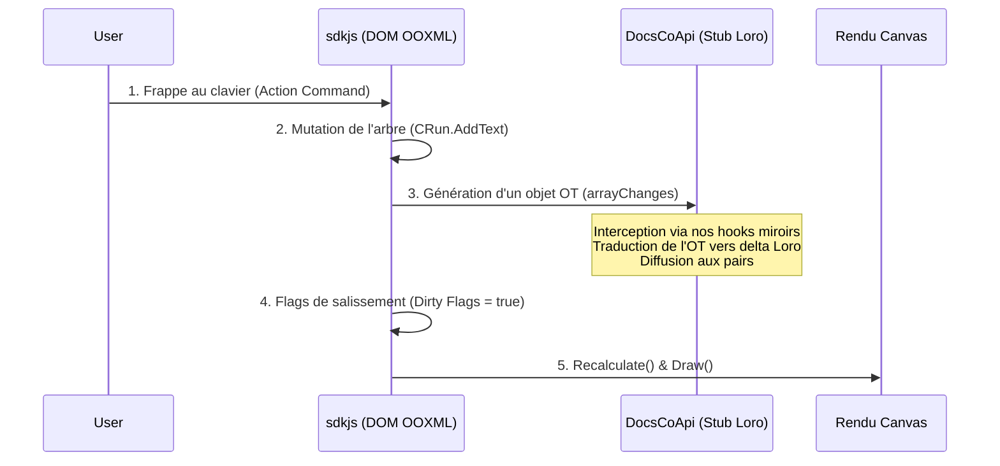
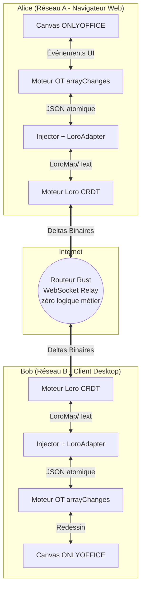
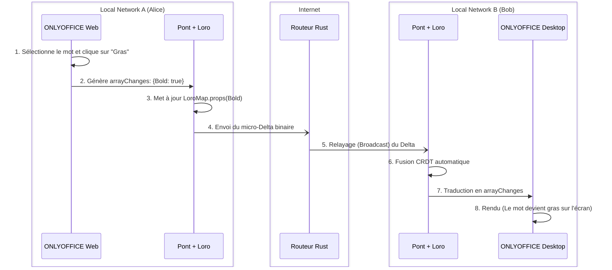
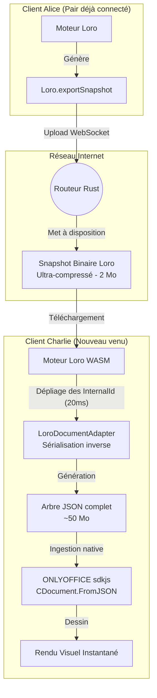

# Architecture : Intégration Loro CRDT × ONLYOFFICE (EuroOffice)

## 1. La Décision Architecturale Fondamentale

**L'objectif :** Obtenir des clients Web et Desktop 100% fonctionnels et hors-ligne, basés sur le moteur de rendu ONLYOFFICE, mais synchronisés via Loro CRDT (P2P) à la place du serveur centralisé classique.

### Le faux problème du parseur `.docx`
Il est important de comprendre que le moteur JS d'ONLYOFFICE (`sdkjs`) **ne parse pas nativement les fichiers `.docx`**. Cette tâche complexe est déléguée à un parseur C++ (`x2t`) qui s'exécute :
- **Sur le serveur** pour la version Web classique (via Document Server).
- **En local** pour la version Desktop (via la librairie native embarquée).
- **Dans le navigateur** via WebAssembly (`core.wasm`) dans certaines déclinaisons.

### La Solution Élégante
**On garde les clients officiels (Web et Desktop) intacts !** 
Ils continueront de gérer l'ouverture, la sauvegarde et l'export PDF du `.docx` avec leurs propres bibliothèques C++ (`x2t` ou `wasm`).
Notre seule intervention consiste à **arracher le "tuyau réseau" (DocsCoApi)** qui les relie normalement au Document Server d'ONLYOFFICE, pour y brancher notre couche de synchronisation **Loro CRDT**.

```mermaid
graph TD
    subgraph Client Officiel (Web ou Desktop Editors)
        UI[Interface Utilisateur / Ruban]
        Parser[Parseur C++ x2t / wasm]
        SDKJS[Moteur sdkjs - DOM Interne]
        DocsCoApi[DocsCoApi - Couche Réseau interceptée]
    end

    subgraph Loro Sync Layer (Notre travail)
        Adapter[LoroDocumentAdapter]
        CRDT[Moteur Loro WASM / Rust]
    end

    subgraph Réseau
        WebRTC[WebRTC / mDNS P2P]
        Relay[Relais léger Rust optionnel]
    end

    DOCX[(Fichier .docx)] <-->|Ouverture / Sauvegarde| Parser
    Parser <-->|Conversion en .bin/.json| SDKJS
    UI <--> SDKJS
    SDKJS <-->|Interception des changements OT| DocsCoApi
    DocsCoApi <-->|Traduction| Adapter
    Adapter <--> CRDT
    CRDT <-->|Diffusion des deltas CRDT| WebRTC
    CRDT <-->|Diffusion des deltas CRDT| Relay
```

---

## 2. Pourquoi Loro est le candidat idéal ?

Le choix de Loro CRDT n'est pas anodin face à Yjs ou Automerge. ONLYOFFICE possède un arbre DOM très complexe.

1. **Movable Tree CRDT natif** : Déplacement concurrent de sections/tableaux sans cycles orphelins (le talon d'Achille de Yjs).
2. **Fugue CRDT (Texte riche)** : Les styles (gras, italique) sont gérés de manière fluide, sans entremêlement lors d'insertions concurrentes.
3. **Eg-walker & Lazy Loading** : Chargement quasi instantané (DocState en RAM, OpLog sur disque) limitant la consommation de mémoire (très pertinent pour une application Electron Desktop).
4. **Zéro serveur central requis** : Résolution déterministe hors-ligne (DAG + Horloges logiques Lamport).

---

## 3. Gestion des conflits hors-ligne (Scénario P2P "Dans le train")

Contrairement à Microsoft 365 (Cobalt) qui génère des fichiers de conflit (`_conflit.docx`) et nécessite une résolution manuelle, Loro garantit une fusion mathématiquement prouvée :

| Cas d'usage | Résultat de la fusion Loro |
|---|---|
| **Parties différentes** (90% des cas) | Fusion instantanée et propre. |
| **Même phrase** (Insertions concurrentes) | L'algorithme Fugue juxtapose le texte de manière déterministe. **Jamais de lettres entremêlées.** |
| **Propriété unique** (Couleur de fond) | **Last-Write-Wins** (Dernier qui écrit a raison) basé sur l'horloge logique Lamport. |
| **Déplacement structurel cyclique** | Si Alice bouge A dans B, et Bob bouge B dans A : LoroTree détecte le cycle et l'arbre ne casse jamais. |

### Visualisation des conflits (Track Changes)
Plutôt que d'imposer des fusions silencieuses qui pourraient altérer le sens d'un contrat, nous exploiterons la fonctionnalité **Track Changes** native d'ONLYOFFICE. 
Les deltas Loro reçus après une reconnexion P2P hors-ligne seront injectés comme des "Révisions" (`AddTrackChangeInsert`), permettant à l'utilisateur d'accepter ou rejeter la fusion visuellement.

---

## 4. Comparatif Serveur : Le saut d'échelle

En remplaçant le tentaculaire Document Server (Node.js, RabbitMQ, Redis, PostgreSQL) par la magie du CRDT (où l'intelligence est dans le client), l'infrastructure serveur optionnelle devient microscopique.

| Métrique | ONLYOFFICE Classique | Relais Rust + Loro |
|---|---|---|
| **Rôle du serveur** | Ordonnanceur, Arbitre, Convertisseur, Session. | Simple "Dumb" Relais WebSocket (Broadcaster). |
| **RAM / document actif** | ~150-250 Mo | **~1-2 Mo** |
| **RAM pour 100 docs** | 15-25 Go | **~150-300 Mo** |
| **RAM au repos** | ~2-3 Go | **~15-30 Mo** (Un seul binaire statique Alpine) |

---

## 5. Synthèse de l'Anatomie de sdkjs & Pipeline de Mutation

Le moteur JS interne reproduit le standard ECMA-376 (OOXML).
Le cycle de vie d'une frappe clavier est le suivant :



Notre hook (déjà initialisé dans la Phase 1.2 avec `Injector.ts`) se situe exactement à l'étape 3. Nous attrapons les changements locaux avant qu'ils ne partent sur le réseau officiel, et nous alimentons notre CRDT pour diffuser l'information.

---

## 6. Structure des fichiers d'interception (Hooks)

Pour éviter de créer un fichier "God class" géant (`interceptor.ts`) qui deviendrait impossible à maintenir, **l'architecture des hooks doit strictement reproduire en miroir l'arborescence originale de sdkjs**. 

Chaque classe interceptée aura son fichier dédié dans notre répertoire `src/hooks/`.

**Exemple d'arborescence :**
```text
loro_sync/src/hooks/
├── word/
│   ├── Editor/
│   │   ├── Paragraph.ts    # Monkey-patch de window.CParagraph
│   │   ├── Run.ts          # Monkey-patch de window.CRun
│   │   └── Table.ts        # Monkey-patch de window.CTable
│   ├── Drawing/
│   │   └── Shape.ts        # Monkey-patch de window.CShape
│   └── document/
│       └── History.ts      # Monkey-patch du Undo/Redo
```
Cette règle garantit que notre code reste lisible, facilement testable de manière unitaire, et immédiatement compréhensible pour un développeur habitué au code source d'ONLYOFFICE.

---

## 7. L'Approche "Industrielle" (DOM-Mirroring Générique)

Pour éviter de devoir coder manuellement la synchronisation des *milliers* de propriétés spécifiques à OOXML (Gras, Italique, Marges, Rotation, Styles de bordure, etc.) qui pourraient changer à chaque mise à jour d'ONLYOFFICE, **notre `LoroDocumentAdapter` utilisera une approche totalement générique basée sur les IDs**.

### Le Registre Plat (Flat Node Registry)
Chaque élément dans `sdkjs` (du paragraphe à la forme vectorielle) possède un identifiant unique généré par le moteur : l'`InternalId`.
Dans le CRDT Loro, nous ne modélisons pas un arbre profond complexe. Nous créons un registre plat :
`const nodes = doc.getMap("nodes");`

### La Traduction Automatique
*   **Création de nœud** : Lorsqu'un élément est instancié dans ONLYOFFICE, on crée génériquement une `LoroMap` avec la clé `InternalId`.
*   **Hiérarchie** : Chaque `LoroMap` contient une `LoroList` nommée `children` qui stocke simplement les `InternalId` de ses enfants dans l'ordre. Le déplacement d'une section entière devient un simple déplacement d'ID dans une liste Loro.
*   **Propriétés (Le secret industriel)** : Au lieu d'intercepter `SetBold()`, `SetRotation()`, etc., nous interceptons les mutations envoyées par ONLYOFFICE. Loro ne se soucie pas de ce qu'est la propriété, il synchronise juste des clés/valeurs JSON.
*   **Texte** : Seules les insertions de caractères appellent de manière spécifique `LoroText.insert()`.

**Avantage décisif** : Cette approche miroir est "future-proof". Si ONLYOFFICE ajoute le support d'une nouvelle ombre 3D dans sa prochaine version, notre code n'aura *absolument pas* besoin d'être mis à jour. Loro synchronisera la nouvelle clé JSON de l'ombre 3D automatiquement.

### L'Élégance du système (Pourquoi nous n'avons pas à coder de Diff complexe)
Si ONLYOFFICE nous renvoyait l'état entier d'un paragraphe à chaque frappe (un énorme JSON très profond), l'injecter d'un coup dans Loro (`props.set("all", { ... })`) casserait la magie du CRDT (écrasement global LWW) et polluerait le réseau. Il faudrait écrire un algorithme de comparaison (Diff) récursif complexe.
**La bonne nouvelle : le système `arrayChanges` résout ce problème nativement.**
Le moteur OT interne d'ONLYOFFICE fait *déjà* le calcul d'atomicité et de diff ! Le tableau `arrayChanges` que nous interceptons ne contient jamais d'objets profonds redondants. Il contient exclusivement des deltas ultra-précis (ex: *Uniquement* la couleur de la bordure a changé). 
*   **Résultat** : Notre pont Loro n'a pas besoin de faire de comparaison récursive coûteuse en performance. Il se contente de prendre la valeur atomique fournie par l'OT (`{"Bold": true}`) et de l'appliquer bêtement dans la `LoroMap`. La granularité du CRDT est donc assurée *gratuitement* par le moteur ONLYOFFICE.

### Le Pont "Passe-Plat" (arrayChanges ↔ Loro)
Le système repose sur la traduction simultanée entre l'OT centralisé (ONLYOFFICE) et le CRDT décentralisé (Loro) via l'`InternalId` comme "plaque d'immatriculation" :

1. **Aller (Local vers Réseau P2P)** :
   - ONLYOFFICE calcule le delta via son système OT (`arrayChanges`). Ex: `[ { "Type": 14, "Id": "run_456", "Props": {"Bold": true} } ]`.
   - L'`Injector` intercepte ce tableau ultra-précis.
   - Le pont lit l'`Id` (`run_456`), retrouve la `LoroMap` correspondante dans le registre plat, et applique la modification.
   - Loro calcule mathématiquement la résolution de conflit (CRDT) et diffuse un micro-Delta binaire sur le réseau.
2. **Retour (Réseau P2P vers Local)** :
   - Le Loro distant reçoit le Delta et déclenche un événement `subscribe()`.
   - Le pont traduit l'événement Loro (ex: `"run_456" a vu "Bold" passer à true`) en recréant un faux objet `arrayChanges`.
   - Cet objet est injecté dans le moteur de rendu d'ONLYOFFICE qui l'ingère naturellement pour dessiner l'écran.

Cette double architecture permet d'avoir la robustesse de l'affichage d'ONLYOFFICE tout en bénéficiant de la magie hors-ligne et P2P du CRDT.

---

## 8. Topologie Réseau et Cas d'Usage (Web vs Desktop)

Voici l'architecture globale en condition réelle : **Alice** utilise l'application Web d'EuroOffice depuis le réseau A, tandis que **Bob** travaille sur l'application native Desktop (Windows/Linux/Mac) depuis le réseau B. Ils collaborent sur le même document via Internet.

### Diagramme de Composants



> **Note :** Les deux clients, bien que sur des plateformes différentes (Web vs Desktop), exécutent exactement la même couche JavaScript/WASM pour `sdkjs` et Loro. Le routeur central ne comprend rien au format Word, il se contente de relayer aveuglément les deltas binaires Loro d'un réseau à l'autre.

### Diagramme de Séquence (Alice tape un mot)



---

## 9. Gestion des Objets Binaires (Images, DrawingML)

Les fichiers binaires lourds (images de 5 Mo, graphiques Excel intégrés) ne doivent **jamais** être stockés dans le CRDT Loro pour éviter d'exploser la RAM des clients (l'historique CRDT est immortel).

1. **Interception HTTP** : L'upload d'image (requête POST) généré par ONLYOFFICE est intercepté.
2. **Blob Store P2P** : Le fichier est envoyé à notre Routeur Rust (qui agit comme un serveur de fichiers statiques miniature).
3. **Ancrage Loro** : Le routeur renvoie un Hash/URL (ex: `blob:sha256:abc123`). Ce Hash est injecté dans le CRDT.
4. **Récupération** : Les autres pairs téléchargent l'image depuis le routeur de manière asynchrone pour l'afficher sur leur Canvas.

Pour les clients Desktop, les chemins locaux (`file:///C:/temp/...`) sont de la même manière interceptés, uploadés en arrière-plan, puis remplacés par les URLs publiques avant d'être inscrits dans Loro.

---

## 10. Les 4 Limites et Défis de l'Architecture "Passe-Plat"

Malgré sa rapidité et son ingénierie générique, cette méthode de traduction OT ↔ CRDT soulève 4 défis techniques majeurs que nous devrons contourner.

### Limite 1 : Le "Cold Start" (Chargement initial du document)

*   **Le scénario du pire** : Charlie ouvre le document pour la première fois. Il reçoit l'historique CRDT Loro (qui contient par exemple 100 pages, soit 50 000 objets). L'outil `arrayChanges` étant conçu pour des micro-deltas, si notre pont devait forcer le moteur ONLYOFFICE à rejouer 50 000 événements `arrayChanges` consécutifs pour reconstruire le document, le thread JavaScript saturerait et le navigateur de Charlie figerait ou crasherait.

*   **La Solution retenue (Séparation Réseau / RAM)** :
    Grâce à l'approche "miroir" de notre registre plat, nous possédons la structure exacte d'ONLYOFFICE. Au lieu d'utiliser l'OT (`arrayChanges`) pour le démarrage, nous pratiquons une **sérialisation inverse** :
    1. **Étape 0 - L'Export par un pair actif (Alice)** : Lorsqu'un nouvel utilisateur (Charlie) souhaite rejoindre la session, un utilisateur déjà présent (Alice) appelle la méthode `LoroDoc.exportSnapshot()`. Le moteur Loro d'Alice génère instantanément le binaire compressé de 2 Mo et l'envoie au Routeur Rust.
    2. **Étape 1 - Le Téléchargement Binaire (Réseau)** : Charlie se connecte au routeur. On ne lui transmet **jamais** de gros JSON. Le réseau lui envoie uniquement ce **Snapshot Binaire Loro** de 2 Mo. La bande passante est préservée.
    3. **Étape 2 - Le Dépliage en RAM (Local)** : Le moteur WASM de Loro charge ce binaire dans la mémoire de Charlie. Immédiatement, le `LoroDocumentAdapter` de Charlie parcourt le registre plat et "déplie" l'arborescence (en liant les `children` et les `props`). Il génère ainsi à la volée un arbre JSON géant (le format `DOCY`). Cette opération purement locale prend environ 20 ms.
    4. **Étape 3 - L'Ingestion Native (ONLYOFFICE)** : Ce gros objet JSON (qui peut peser 50 Mo en mémoire vive) est passé directement à la méthode native `CDocument.FromJSON()` de SDKJS. ONLYOFFICE affiche le document d'un coup, sans utiliser le moindre `arrayChanges`, et le JSON temporaire est détruit par le Garbage Collector.



### Limite 2 : Le Phénomène d'Écho (Boucle infinie)
*   **Le problème** : Lorsqu'on applique un Delta entrant chez Bob (via `arrayChanges`), le moteur ONLYOFFICE de Bob réagit en générant lui-même un nouvel `arrayChanges` sortant (pour prévenir le réseau que son écran a changé). S'il est relayé, cela crée une boucle infinie de modifications.
*   **La Solution retenue (Le Mutation Guard)** :
    Nous devons implémenter un verrou (lock) asynchrone dans notre intercepteur (`Injector.ts`).
    1. Définir un flag global `isApplyingRemoteUpdate = false`.
    2. À la réception d'un Delta réseau : on passe le flag à `true`.
    3. On injecte le `arrayChanges` dans le moteur natif.
    4. L'intercepteur de ONLYOFFICE s'active et tente de faire un `saveChanges(arrayChanges)`.
    5. **Le Verrou** : Dans notre hook `saveChanges`, on ajoute la condition `if (isApplyingRemoteUpdate) return;`. La modification n'est donc pas renvoyée au réseau.
    6. Une fois le rendu terminé, on repasse le flag à `false`. L'écho est bloqué.

### Limite 3 : La perte de l'intention sémantique (Fusions complexes)
*   **Le problème** : L'OT d'ONLYOFFICE fragmente des opérations complexes (ex: fusionner deux cellules d'un tableau) en opérations de très bas niveau (déplacement de texte, suppression de bordure, etc.). Si un conflit P2P survient pendant cette opération, Loro pourrait entrelacer ces briques avec l'action d'un autre utilisateur, aboutissant à un tableau graphiquement corrompu.
*   **La Solution retenue (L'Approche Transactionnelle)** :
    Loro possède une fonction native de transactions (`doc.commit()`).
    Heureusement, ONLYOFFICE groupe toutes les micro-opérations d'une action utilisateur (comme "Fusionner") dans un seul et même tableau `arrayChanges`.
    Au lieu d'appliquer chaque élément de l'array isolément dans Loro, le pont ouvrira une Transaction Loro, appliquera toutes les modifications de l'array, puis fera un `commit()`. Ainsi, Loro traitera la fusion de cellules comme un **bloc atomique indivisible**, interdisant toute corruption de l'intention structurelle en cas de conflit.

### Limite 4 : La dépendance au protocole privé (Reverse-Engineering)
*   **Le problème** : L'objet `arrayChanges` n'est pas une API publique. ONLYOFFICE peut modifier sa structure de manière arbitraire (ex: renommer le code `Type: 14` en `Action: "Format"`) dans une future version, ce qui casserait instantanément notre pont.
*   **La Solution retenue (Le Fork et l'Isolation du Mapper)** :
    1. **Version Pinning** : Nous figeons la version de `sdkjs` (ex: `v8.1.0`) dans notre dépôt. Pas de mise à jour automatique.
    2. **Design Pattern Adapter** : Nous allons isoler TOUTE la logique de traduction des codes magiques (comme `Type: 14`) dans un seul fichier : `ArrayChangesMapper.ts`. 
    3. **Tests E2E Playwright** : Une suite de tests cliquera automatiquement sur les boutons de l'UI d'ONLYOFFICE (Gras, Insérer Tableau) et vérifiera que le `Mapper` génère la bonne structure Loro. Lors d'une montée de version d'ONLYOFFICE, si la syntaxe `arrayChanges` change, les tests exploseront instantanément, et il suffira de corriger cet unique fichier `Mapper` sans toucher au reste de l'architecture.

### Limite 5 : La Priorité Fichier vs Réseau (Cas du double-clic Desktop / Seafile)
*   **Le problème** : Si Bob double-clique sur un fichier `.docx` synchronisé par Seafile sur son bureau, l'application ONLYOFFICE Desktop charge d'abord le fichier local. Mais si Alice est *déjà* en train de modifier ce même document en ligne, comment le client de Bob le sait-il ? S'il injecte naïvement son `.docx` local dans son Loro, il va créer des doublons avec le document d'Alice (chaque paragraphe aura un ID différent dans les deux Loro).
*   **La Solution retenue (Le Handshake Réseau d'abord)** :
    L'architecture doit imposer une priorité stricte au démarrage :
    1. Bob ouvre le fichier. Le Canvas d'ONLYOFFICE affiche le `.docx` local.
    2. En tâche de fond, le pont de Bob contacte le Routeur Rust (avec un Room ID basé sur le hash du fichier).
    3. **Scénario A (Bob est seul)** : Le routeur répond "Salle vide". Le pont de Bob prend alors le `.docx` affiché à l'écran, génère la structure Loro initiale (de ONLYOFFICE vers Loro) et devient la "graine" (le *Seeder*) pour le réseau.
    4. **Scénario B (Alice est déjà là)** : Le routeur répond "Salle active" et envoie le Snapshot Loro d'Alice. Le pont de Bob **détruit** immédiatement l'état Loro et le Canvas local, charge le Snapshot d'Alice, refait un Cold Start (Loro ➔ JSON ➔ `FromJSON`), et le document à l'écran se met à jour magiquement avec les dernières frappes d'Alice.

---

## 11. Résilience et Partition Réseau (Le Scénario de l'Avion)

L'un des avantages majeurs de l'architecture CRDT (comparé à l'OT centralisé d'ONLYOFFICE ou de Google Docs) est sa capacité native à gérer les coupures réseau prolongées et les réseaux éclatés (Network Partitions).

### Le Scénario
1. **Dans l'avion (Réseau Ad-hoc P2P)** : Alice et Bob prennent un vol. Ils n'ont pas accès à Internet, mais ils se connectent en Wi-Fi local direct. Leurs moteurs Loro s'échangent les micro-deltas en P2P pur. Ils voient leurs modifications respectives en temps réel.
2. **Sur Terre (Internet)** : Charlie, resté au bureau, modifie le même document, seul, via le Routeur Rust.
3. **L'Atterrissage (La Réconciliation)** : Alice et Bob atterrissent et retrouvent la connexion 4G. Leurs clients se reconnectent au Routeur Rust central.
4. **La Fusion Mathématique** : Les Loro d'Alice et Bob envoient toutes les frappes accumulées pendant le vol au Routeur, qui les relaie à Charlie. Le CRDT utilise ses horloges de Lamport pour entremêler les textes d'Alice, Bob et Charlie de manière parfaitement déterministe. **Les trois collaborateurs finissent avec exactement le même document fusionné.**

### ⚠️ Le Piège de l'Origine (The Common Ancestor)
Pour que cette magie opère, **les clients doivent obligatoirement partager le même ancêtre Loro (historique racine)** avant la coupure réseau. 
Si Alice (dans l'avion) et Charlie (sur terre) prennent tous les deux un document `.docx` vierge et l'injectent **indépendamment** dans Loro (via le processus de *Seeding* décrit à la Limite 5), les moteurs vont générer des `InternalId` différents.
À l'atterrissage, Loro considèrera qu'il s'agit de deux documents totalement distincts et refusera de les fusionner.
*   **La Règle d'Or** : La résilience P2P fonctionne parfaitement à la condition stricte que le document ait été synchronisé au moins une fois (via son fichier caché `.loro` par exemple) avant la partition réseau, afin que tout le monde partage le même arbre d'identifiants.
