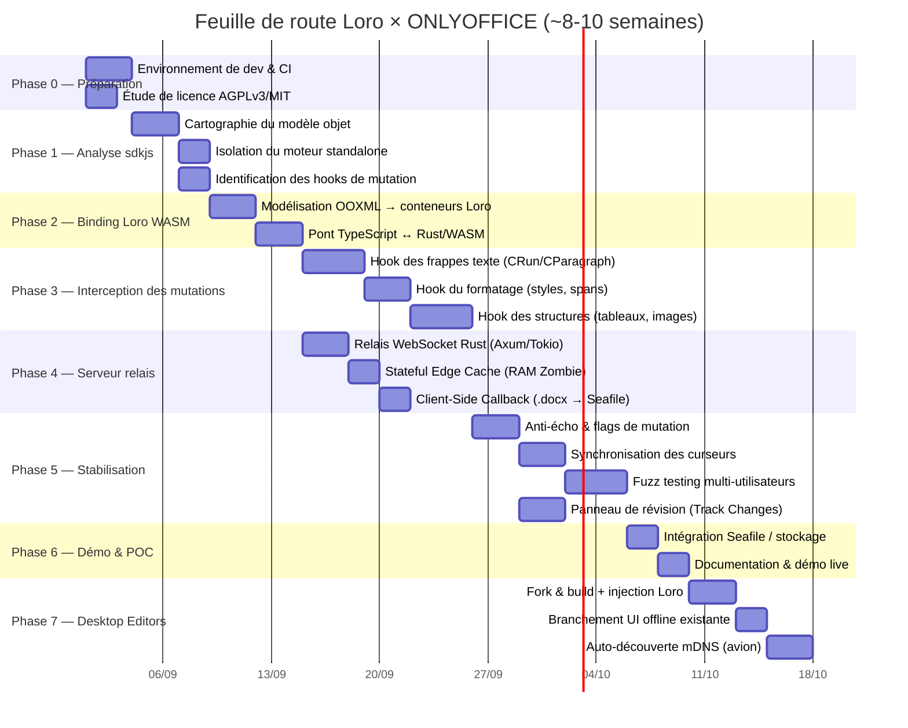

# Feuille de route : Intégration Loro CRDT × ONLYOFFICE/EuroOffice

## Vue d'ensemble



---

## Phase 0 — Préparation de l'environnement (3 jours)

### Objectif
Mettre en place l'outillage, le dépôt et les bases juridiques avant d'écrire la première ligne de code.

### Tâches

| # | Tâche | Détail | Livrable |
|---|---|---|---|
| 0.1 | **Fork du dépôt sdkjs** | Cloner `ONLYOFFICE/sdkjs` (branche stable v8.x). Créer un dépôt privé `eurooffice-loro`. | Repo Git configuré |
| 0.2 | **Workspace de dev reproductible** | Dockerfile de développement : Node.js 20 + Rust toolchain (rustup, wasm-pack, wasm-bindgen-cli) + Vite pour le hot-reload JS. | `docker-compose.dev.yml` fonctionnel |
| 0.3 | **Build standalone de sdkjs** | Compiler sdkjs en mode Desktop/standalone (sans document-server). Vérifier qu'un `.docx` s'ouvre et se rend dans un `<canvas>` sans backend Node.js. | Page HTML qui ouvre un .docx localement |
| 0.4 | **Audit de licence** | Confirmer la compatibilité AGPLv3 (ONLYOFFICE) + MIT/Apache-2.0 (Loro). Le résultat distribué sera AGPLv3. Documenter les obligations (publication du code source modifié). | Note juridique dans le README |
| 0.5 | **CI/CD minimal** | GitHub Actions : `cargo test` (Rust), `npm test` (JS), build WASM automatique. | Pipeline vert |

### Risques
- La compilation standalone de sdkjs peut nécessiter de stubber des APIs du document-server → prévoir 1 jour de marge.

---

## Phase 1 — Analyse et cartographie de sdkjs (5 jours)

### Objectif
Comprendre précisément **où** et **comment** le DOM interne est muté, pour savoir quoi intercepter.

### 1.1 Cartographie du modèle objet (3 jours)

Utiliser un agent LLM pour analyser les fichiers clés et produire un document de référence :

```
sdkjs/word/
├── document/CDocument.js        → Racine du document
├── document/CParagraph.js       → Paragraphes (4000+ lignes)
├── document/CRun.js             → Segments de texte homogènes
├── document/CTable.js           → Tableaux
├── document/CSection.js         → Sections (marges, orientation)
├── drawing/CShape.js            → Formes vectorielles
└── api/asc_docs_api.js          → API publique exposée au web-apps
```

**Livrable** : Document Markdown `sdkjs-dom-map.md` avec :
- Arbre d'héritage des classes principales
- Liste exhaustive des méthodes de mutation (`AddText`, `SetBold`, `SplitRun`, `MergeTableCells`...)
- Diagramme du pipeline mutation → dirty flags → recalculate → draw

### 1.2 Isolation du moteur réseau (2 jours)

*Note architecturale : L'idée initiale de créer un standalone HTML chargeant des fichiers .docx a été abandonnée car sdkjs ne parse pas nativement le .docx (c'est le rôle de `x2t`/`wasm` dans les clients Web et Desktop officiels). Nous conservons donc les clients officiels intacts.*

| Tâche | Détail |
|---|---|
| Arracher le tuyau réseau (`DocsCoApi`) | Créer un script d'injection (`Injector.ts`) qui stubbe `AscCommon.CDocsCoApi` pour bloquer la communication WebSocket vers le Document Server. |
| Intercepter `saveChanges` | Dévier les objets de mutation OT locaux (`arrayChanges`) vers notre futur traducteur CRDT au lieu du réseau officiel. |
| Valider l'isolement | Démontrer que le client fonctionne sans backend, et que les frappes locales sont interceptées par le script d'injection. |

### 1.3 Identification du hook unique (arrayChanges) (1 jour)

Dans une approche classique, nous aurions dû intercepter des dizaines de méthodes (`CRun.AddText()`, `CTable.AddRow()`, etc.). 
Cependant, l'analyse montre que le moteur OT interne d'ONLYOFFICE concentre toutes ses mutations dans un seul pipeline de sortie : le tableau `arrayChanges`.

| Tâche | Détail |
|---|---|
| Repérer le point d'émission | Trouver la fonction interne `AscCommon.CDocsCoApi.saveChanges` qui prépare l'envoi réseau. |
| Intercepter le payload | Hooker cette fonction pour capturer l'objet `arrayChanges` avant qu'il ne parte sur le WebSocket. |
| Muter en silence | Vérifier que nous pouvons réinjecter un `arrayChanges` venant du réseau via `ApplyChanges()` sans déclencher de boucle infinie. |

**Livrable** : Fichier `hooks-inventory.md` simplifié (une seule cible d'interception).

---

## Phase 2 — Binding Loro WASM ↔ TypeScript (6 jours)

### Objectif
Créer le **modèle de données Loro** qui reflète un document OOXML, et le pont TypeScript pour l'alimenter.

### 2.1 Modélisation OOXML → LoroTree (3 jours)

Concevoir le schéma CRDT qui représente un document Word à l'aide de la structure arborescente native de Loro :

```typescript
// Structure cible du LoroDoc
const doc = new LoroDoc();

// Arbre universel des nœuds (LoroTree)
const tree = doc.getTree("document");

// Création d'un nœud Paragraphe
const paraNode = tree.createNode();
// Les propriétés génériques sont stockées aveuglément sur le nœud
paraNode.data.set("type", "Paragraph");
paraNode.data.set("style", "Heading1");
paraNode.data.set("alignment", "center");

// Le texte est géré séparément pour gérer les conflits spatiaux
const textContent = doc.getText("text_" + paraNode.id);
```

> [!IMPORTANT]
> **Décision architecturale critique** : Nous utilisons le `LoroTree` qui gère nativement les déplacements de nœuds (Move) de manière sécurisée (sans créer de cycles), rendant les listes imbriquées (`LoroList`) obsolètes.

### 2.2 Pont TypeScript ↔ Rust/WASM (3 jours)

| Tâche | Détail |
|---|---|
| Intégrer `loro-crdt` via npm | `npm install loro-crdt` (package officiel compilé en WASM) |
| Créer `LoroDocumentAdapter.ts` | Classe centrale qui encapsule le `LoroDoc` et expose des méthodes typées : `insertText(paraIndex, offset, text)`, `deleteText(...)`, `setMark(...)`, `addParagraph(...)` |
| Créer `LoroSyncManager.ts` | Gère la connexion WebSocket, l'export/import des deltas binaires, et le buffering des opérations offline |
| Créer `LoroAwareness.ts` | Canal léger séparé pour les curseurs et sélections des autres utilisateurs (pas stocké dans le CRDT principal) |
| Tests unitaires | 30+ tests : insertion, suppression, formatage concurrent, serialisation/désérialisation d'un LoroDoc complet |

**Livrable** : Package `@eurooffice/loro-bridge` testable indépendamment de sdkjs.

---

## Phase 3 — Interception des mutations sdkjs (11 jours)

### Objectif
Brancher le pont Loro sur le pipeline de mutations de sdkjs. C'est **la phase la plus complexe**.

### 3.1 L'Approche Industrielle : Le Registre Plat (Flat Node Registry) (3 jours)

Au lieu de modéliser manuellement un arbre DOM complexe, nous créons un miroir générique du DOM d'ONLYOFFICE basé sur les identifiants uniques (`InternalId`) :

```typescript
// Structure cible du Registre Plat
const doc = new LoroDoc();
const nodes = doc.getMap("nodes"); // Le registre universel

// Création générique d'un nœud (applicable à Word, Excel, PowerPoint)
const paraNode = new LoroMap();
paraNode.set("type", "Paragraph");
paraNode.setContainer("props", new LoroMap()); // Pour stocker Bold, Margins, etc.
paraNode.setContainer("children", new LoroList()); // Pour stocker les InternalId des enfants
nodes.setContainer("para_123", paraNode);
```

### 3.2 Interception du moteur OT (arrayChanges) (4 jours)

Plutôt que d'intercepter individuellement `SetBold()`, `AddText()`, etc., nous allons écouter le flux de sortie du moteur OT interne d'ONLYOFFICE (`arrayChanges`).

| Avantage | Détail |
|---|---|
| **Atomicité garantie** | L'OT natif calcule déjà le delta exact (ex: *seule la bordure a changé*). |
| **Future-proof** | Si ONLYOFFICE ajoute une nouvelle propriété visuelle, le pont la synchronisera automatiquement sans modification du code. |
| **Performance** | Pas besoin d'algorithme de "Diff" coûteux en RAM côté Loro. |

### 3.3 Le pont "Passe-Plat" (ArrayChangesMapper) (4 jours)

Il s'agit de construire la classe de traduction bidirectionnelle :
1. **Aller (Local → Réseau)** : Intercepter le tableau `arrayChanges` généré par `sdkjs`, lire l'ID de l'objet affecté, et reporter la clé/valeur bêtement dans le `LoroMap` correspondant. Loro génère le delta binaire.
2. **Retour (Réseau → Local)** : Quand le Loro distant notifie une mise à jour (`subscribe()`), le Mapper reconstruit un faux objet `arrayChanges` et l'injecte dans le moteur de rendu d'ONLYOFFICE.

> [!WARNING]
> **Le défi majeur** : Isoler complètement la logique de traduction des "Magic Codes" de l'OT d'ONLYOFFICE (ex: `Type: 14`) dans ce fichier de Mapping unique, pour protéger le projet des changements d'API futurs.

### 3.4 Sécurisation : Le Mutation Guard (inclus)

```typescript
// Le verrou anti-écho (pour éviter les boucles infinies de deltas)
let isApplyingRemoteUpdate = false;

loroDoc.subscribe((event) => {
  if (event.by === "import") {
    isApplyingRemoteUpdate = true;
    
    const fakeArrayChanges = mapper.loroEventToArrayChanges(event);
    sdkDocument.ApplyChanges(fakeArrayChanges); // Injection native
    
    // Le hook saveChanges d'ONLYOFFICE devra bloquer l'émission réseau si isApplyingRemoteUpdate === true
    
    isApplyingRemoteUpdate = false;
  }
});
```

---

## Phase 4 — Serveur relais et persistance (7 jours)

### 4.1 Relais WebSocket Rust (3 jours)

Architecture minimaliste déjà détaillée dans la synthèse :

```
loro-relay-server/
├── Cargo.toml
├── Dockerfile          # Multi-stage build, image finale FROM scratch (~15 Mo)
├── docker-compose.yml
└── src/
    ├── main.rs         # Axum router + upgrade WebSocket
    ├── relay.rs        # DashMap<DocId, broadcast::Sender<Bytes>>
    └── auth.rs         # Vérification JWT/Token Seafile (optionnel)
```

| Fonctionnalité | Détail |
|---|---|
| Routing par document | `GET /ws/:doc_id` → upgrade WebSocket |
| Broadcast zéro-copie | `tokio::sync::broadcast` avec `Bytes` (pas de sérialisation) |
| Auto-nettoyage | Suppression de la room quand `receiver_count() == 0` |
| Authentification | Vérification d'un token JWT ou Seafile en amont de l'upgrade WebSocket |
| Métriques | Endpoint `/metrics` (Prometheus) : nombre de rooms actives, connexions, octets relayés |

### 4.2 Le Stateful Edge Cache (Cache Zombie en RAM) (2 jours)

Conformément à la nouvelle architecture, le Routeur Rust **n'a pas de base de données et n'écrit jamais sur le disque dur**. Il gère les micro-coupures réseau en stockant le document en mémoire vive de manière éphémère.

```rust
// Dans le routeur Rust (Axum) : Cache RAM de 15 minutes
struct TwinCache {
    docx: Vec<u8>,
    loro: Vec<u8>,
    timestamp: Instant,
}

// L'état est stocké dans une DashMap en mémoire vive
edge_cache: DashMap<String, TwinCache>
```

| Tâche | Détail |
|---|---|
| Route `POST /room/:id/twin` | Reçoit le Jumeau envoyé silencieusement par les clients actifs toutes les 60s. |
| Route `GET /room/:id/twin` | Sert le Jumeau aux nouveaux arrivants si le document est orphelin (Alice a crashé). |
| Garbage Collection | Le Jumeau expire et est effacé de la RAM après 15 minutes (Grace Period). |

### 4.3 Le Client-Side Callback (.docx → Seafile) (2 jours)

Puisque nous refusons de sauvegarder le binaire `.loro` sur Seafile (pour forcer la comparaison métier native hors-ligne), c'est le **client web qui génère le `.docx` final et l'uploade sur Seafile**.

```typescript
// Déclenché au clic sur "Sauvegarder" (ou autosave)
async function pushDocxToSeafile(editor: any, callbackUrl: string) {
  // 1. Demande au moteur C++ compilé en WASM de générer le fichier .docx
  const docxBlob = await editor.downloadAs("docx"); 

  // 2. Upload vers l'API de Seafile
  const formData = new FormData();
  formData.append("file", docxBlob, "document.docx");

  await fetch(callbackUrl, {
    method: "POST",
    body: formData
  });
}
```

**Conséquence** : Nous remplaçons complètement le Document Server backend de ONLYOFFICE. L'export `.docx` est déporté à 100% dans le navigateur de l'utilisateur via WebAssembly.

---

## Phase 5 — Stabilisation et UX (10-13 jours)

### 5.1 Anti-écho et flags de mutation (3 jours)

Le problème central : quand un delta distant est appliqué sur sdkjs, sdkjs émet naturellement un événement de modification qui serait capturé par le hook et renvoyé à Loro en boucle infinie.

```typescript
class MutationGuard {
  private _depth = 0;

  /** Encadre l'application d'une modification distante */
  applyRemote(fn: () => void) {
    this._depth++;
    try {
      fn();
    } finally {
      this._depth--;
    }
  }

  /** Vérifie si on est dans un contexte local (à capturer) ou distant (à ignorer) */
  isLocal(): boolean {
    return this._depth === 0;
  }
}
```

| Cas limite | Solution |
|---|---|
| Mutation distante déclenche un split de CRun | Le flag `_depth > 0` empêche la réémission |
| Undo local qui annule une modification distante | L'undo passe par `CHistory` → capturé comme mutation locale → propagé normalement |
| Recalculate déclenché pendant un batch de deltas | Accumuler les deltas, appliquer en batch, puis un seul `Recalculate()` |

### 5.2 Synchronisation des curseurs (3 jours)

Les positions de curseur ne sont **pas** stockées dans le CRDT principal (elles sont éphémères).

| Composant | Implémentation |
|---|---|
| Canal Awareness | WebSocket secondaire ou sous-canal dédié sur le même socket |
| Données transmises | `{ peerId, name, color, cursorParaIndex, cursorOffset, selectionRange }` |
| Fréquence | Throttled à 50ms max (éviter le flood réseau) |
| Affichage sdkjs | Injecter des `CCollaborativeCursor` dans le Canvas (trait vertical coloré + étiquette nom) |
| Transformation des positions | Quand un delta distant déplace du texte **avant** la position du curseur distant → recalculer l'offset via les métadonnées Loro |

### 5.3 Fuzz testing multi-utilisateurs (4 jours)

Cadre de test automatisé simulant N clients concurrents :

```typescript
// Test de convergence : 5 clients tapent simultanément pendant 10 secondes
async function fuzzTest(numClients: number, durationMs: number) {
  const docs = Array.from({ length: numClients }, () => new LoroDoc());

  // Chaque client effectue des opérations aléatoires
  for (let t = 0; t < durationMs; t += 10) {
    for (const doc of docs) {
      const op = randomOperation(); // insert, delete, mark, moveParagraph
      applyOperation(doc, op);
    }
    // Synchroniser tous les pairs entre eux
    fullSync(docs);
  }

  // ASSERTION : tous les documents sont identiques
  const states = docs.map(d => d.getText("content").toString());
  assert(new Set(states).size === 1, "Désynchronisation détectée !");
}
```

| Scénario de fuzz | Ce qu'on vérifie |
|---|---|
| 5 clients tapent dans le même paragraphe | Convergence du texte (pas d'entremêlement) |
| Insert + delete concurrents au même offset | Cohérence de l'arbre Loro et du DOM sdkjs |
| Formatage concurrent (gras + italique) | Les marks ne se corrompent pas mutuellement |
| Ajout/suppression de lignes de tableau | La structure tabulaire reste valide |
| Undo simultané sur 2 clients | L'état converge sans crash |
| Déconnexion brutale + reconnexion | Le binlog permet la reconstruction exacte |

### 5.4 Panneau de révision / Track Changes (3 jours)

Réutiliser le système natif d'ONLYOFFICE :

```typescript
// À chaque import distant, mapper les deltas sur le Track Changes sdkjs
loroDoc.subscribe((event) => {
  if (event.by === "import") {
    for (const textEvent of event.events.filter(e => e.target.kind === "Text")) {
      for (const delta of textEvent.diff) {
        if (delta.insert) {
          sdkApi.AddTrackChangeInsert(offset, delta.insert, authorName, authorId, Date.now());
        }
        if (delta.delete) {
          sdkApi.AddTrackChangeDelete(offset, delta.delete, authorName, authorId, Date.now());
        }
      }
    }
  }
});
```

**Fonctionnalités livrées** :
- Insertions distantes surlignées en couleur (1 couleur par auteur)
- Suppressions distantes barrées
- Boutons « Accepter » / « Rejeter » dans le panneau latéral natif
- Export des modifications en balises `<w:ins>` / `<w:del>` dans le .docx sauvegardé

---

## Phase 6 — Démo et POC (4 jours)

### 6.1 Intégration Seafile (2 jours)

| Tâche | Détail |
|---|---|
| Ouvrir un .docx depuis Seafile | Click sur un fichier → le navigateur charge le .docx, le parse via sdkjs, peuple le LoroDoc |
| Sauvegarder vers Seafile | Le client sérialise l'arbre Loro → reconstruit le .docx via sdkjs → pousse vers l'API Seafile |
| Verrouillage léger | Un fichier en cours d'édition est marqué « en co-édition Loro » dans Seafile (icône / badge) |

### 6.2 Documentation et démo live (2 jours)

| Livrable | Contenu |
|---|---|
| README.md | Architecture, prérequis, installation, déploiement Docker |
| Vidéo démo (3 min) | 3 navigateurs éditant le même .docx en temps réel |
| Document de benchmark | RAM serveur mesurée vs ONLYOFFICE Document Server classique |
| Feuille de route v2 | DrawingML, Calc/tableur, Impress/slides, mode P2P WebRTC |

---

## Récapitulatif des livrables par phase

| Phase | Durée | Livrable principal | Risque |
|---|---|---|---|
| **0 — Préparation** | 3j | Environnement de dev + CI + note juridique | Faible |
| **1 — Analyse sdkjs** | 5j | `sdkjs-dom-map.md` + `hooks-inventory.md` | Moyen |
| **2 — Binding Loro** | 6j | Package `@eurooffice/loro-bridge` testé | Moyen |
| **3 — Interception** | 11j | Mapper universel `arrayChanges` et Cold Start | **Élevé** |
| **4 — Serveur relais** | 7j | Container Docker `loro-relay` + persistance | Faible |
| **5 — Stabilisation** | 10j | Anti-écho, curseurs éphémères, Fuzz Testing | **Élevé** |
| **6 — Extensions & Démo** | 4j | Intégration Seafile, Tableur, Lazy Loading Images | Moyen |
| **7 — Desktop Editors** | 8j | Auto-découverte mDNS P2P (Node.js) | Moyen |

---

## Plan d'Exécution Détaillé (Checklist d'Implémentation)

Utilisez cette section pour suivre l'avancement concret du projet par rapport aux décisions documentées dans `architecture.md`.

### Phase 0 à 2 : Fondations
- [x] Initialiser le dépôt Vite (ESM + WASM) avec Loro CRDT (`package.json`, `vite.config.ts`).
- [x] Créer le Dockerfile de développement.
- [x] Rédiger la stratégie globale (`architecture.md`, `tests_strategy.md`).
- [x] Isoler le moteur réseau d'ONLYOFFICE (Monkey-Patching de `AscCommon.CDocsCoApi` via `Injector.ts`).
- [x] Définir la structure du Registre Plat (`LoroDocumentAdapter`).

### Phase 3 : Le Pont "Passe-Plat" et le Cold Start (Le MVP)
- [x] Créer la coquille vide de `ArrayChangesMapper.ts`.
- [x] Implémenter le hook de capture locale : router le flux `arrayChanges` vers le Mapper.
- [x] Implémenter le "Mutation Guard" (verrou anti-écho) pour bloquer les boucles de synchronisation.
- [x] Implémenter la structure arborescente avec `LoroTree` (remplace les LoroList).
- [x] Créer le tampon heuristique (debounce) pour convertir les Delete+Insert en `LoroTree.move()`.
- [x] **(SUPPRIMÉ)** Rédiger le code de désérialisation rapide (Cold Start : Loro ➔ JSON ➔ `FromJSON`). Remplacé par le Transfert Jumeau.

**Traduction des 5 Primitives Structurelles (Remplaçant la cartographie métier) :**
*Puisque le pont est un "passe-plat" aveugle, nous n'avons plus besoin de cartographier les objets métier (Tableaux, Paragraphes, Listes...). Il suffit de traduire les 5 actions structurelles abstraites de base émises par `arrayChanges` vers les API CRDT de Loro :*
- [x] Traduire les deltas textuels (Insertion/Suppression de caractères) ➔ Méthodes natives de `LoroText`.
- [x] Traduire la création de nœud (`CreateNode` : Paragraphe, Tableau, Image, etc.) ➔ `LoroTree.createNode()`.
- [x] Traduire la suppression de nœud (`DeleteNode`) ➔ `LoroTree.delete()`.
- [x] Traduire le déplacement de nœud (`MoveNode`) ➔ `LoroTree.move()`.
- [x] Traduire la modification de propriété (`SetProperty` : Gras, Marge, Ombre, etc.) ➔ `LoroTreeNode.set()` (Stockage aveugle du JSON, sans chercher à le comprendre).

### Phase 4 : Routeur Rust et Seafile
- [x] Bootstraper le Routeur Rust (Axum + Tokio + WebSockets).
- [x] Implémenter l'authentification aveugle (Validation JWT sans accès au contenu).
- [x] Mettre en place le Blob Store (intercept. des uploads d'images ➔ Stockage temporaire ➔ Renvoi d'un Hash au client).
- [x] Implémenter le "Client-Side Callback" : hooker le bouton "Sauvegarder" pour envoyer le snapshot final à Seafile.
- [x] Mettre en place l'interception de l'historique Seafile pour restaurer le bouton natif ONLYOFFICE (Section 19.3).
- [x] Implémenter le "Stateful Edge Cache" (cache RAM) sur le Routeur Rust avec une "Grace Period" de 15 minutes.
- [x] Côté client : configurer le push silencieux du Jumeau (`.docx` + `.loro`) au routeur toutes les 60 secondes (délai paramétrable et dépendant de la taille du document).
- [x] Côté client (Cold Start) : Prioriser le téléchargement du Jumeau Zombie depuis le routeur plutôt que le fichier Seafile si disponible.

### Phase 5 : Awareness, Tests et Optimisations
- [x] Créer le gestionnaire de "Lazy Loading / Frustum Culling" pour les images (`lazyImageLoader.ts`).
- [x] Remplacer le `Undo/Redo` natif (Ctrl+Z) par l'API Time-Travel de Loro (Section 7.1).
- [x] Câbler l'API native `CCollaborativeCursor` avec le canal éphémère (Awareness) pour les curseurs distants limités à 50ms.
- [x] Implémenter le "Soft-Lock" visuel (Mode Strict émulé) via l'Awareness.
- [x] Désactiver le chat interne (`customization.chat = false`) pour intégration Matrix.
- [x] Rédiger la suite E2E Playwright de vérification de convergence.
- [x] Mettre en place le Bot Node.js "Headless" pour la génération PDF côté serveur.
- [x] Implémenter le "State Transfer P2P" (Jumeau Atomique DOCX+Loro) dans `LoroSyncManager.ts` pour le Cold Start.

### Phase 6 & 7 : Multi-formats et Desktop
- [x] Validation croisée du Mapper `ArrayChangesMapper.ts` sur Excel (`cell`) et PowerPoint (`slide`).
- [x] Injecter le pont Loro dans l'environnement Chromium/Node.js de l'application Desktop.
- [x] Implémenter la diffusion et l'écoute mDNS (Auto-découverte P2P locale).
- [x] Gérer la bascule asynchrone (Mode Avion ➔ Internet) pour le routage de l'Awareness et du CRDT.

---

## MVP vs Extensions : clarification architecturale

> [!IMPORTANT]
> **L'architecture P2P a provoqué l'effondrement de la complexité.**
> Grâce au **Transfert Jumeau Atomique**, nous n'avons **plus jamais besoin d'appeler `FromJSON()`** pour initialiser un document. 
> Conséquence radicale : **La Phase 3.5 (Cartographie de l'anatomie JSON des objets complexes) est totalement annulée et supprimée.**
> 
> Le moteur natif `arrayChanges` d'ONLYOFFICE est 100% générique. Que ce soit une image, une fusion de cellules ou un graphique 3D, ONLYOFFICE émet un événement générique (ex: `{ Type: 58, Id: "obj_1", Props: {...} }`). 
> Notre pont Loro se comporte désormais comme un pur **"Passe-Plat" aveugle** :
> 1. Il intercepte ce delta générique.
> 2. Il l'injecte dans le CRDT sous forme de propriété sur un identifiant unique.
> 3. Le réseau P2P le synchronise.
> 4. Le pont du destinataire lit la propriété et recrache le delta générique à son propre ONLYOFFICE.
> 
> **La rétro-ingénierie (Reverse Engineering) est terminée.** Seul le texte brut (frappes clavier) nécessite une traduction spécifique (vers `LoroText`) à cause des conflits d'index. Tout le reste est synchronisé gratuitement sans aucun effort de développement supplémentaire, réduisant la charge de travail de plusieurs mois à zéro !
> 4. Écrire les tests de convergence (via Playwright) associés.
>
> **Aucune modification d'architecture** n'est nécessaire : le pont, le MutationGuard, le relais Rust et la persistance restent identiques pour tous les formats.


---

## Phase 7 — Intégration Desktop Editors (8 jours)

### Pourquoi c'est beaucoup plus simple que prévu (avec un bémol pour le P2P)

DesktopEditors embarque **Chromium/CEF complet**. Ce n'est pas un binaire C++ natif avec ses propres APIs réseau : c'est un navigateur web encapsulé. Par conséquent :

> [!IMPORTANT]
> **Le transport réseau (client) est strictement identique au web.** WebSocket et WebRTC fonctionnent dans Chromium/CEF exactement comme dans Chrome/Firefox. L'accès direct au système de fichiers (API `fs` de Node.js) permet la persistance `.loro` locale.

Cependant, **pour l'auto-découverte P2P purement hors-ligne** (le scénario de l'avion sans aucun routeur internet) : WebRTC a *toujours* besoin d'échanger des coordonnées initiales (Signaling). Sans internet, les API web classiques sont bloquées. C'est ici que l'accès à **Node.js** devient vital.

### 7.1 Fork, build et injection (3 jours)

| Tâche | Détail |
|---|---|
| Cloner `ONLYOFFICE/DesktopEditors` | Identifier le point d'injection dans le renderer Chromium |
| Injecter `@eurooffice/loro-bridge` | Même package npm que le web, chargé dans le `preload.js` ou `renderer.js` |
| Brancher le `LoroSyncManager` | **Identique au web** — WebSocket vers le relais Rust distant |
| Valider | Ouvrir un .docx, co-éditer avec un navigateur web standard → les deux convergent |

### 7.2 Branchement sur l'UI offline existante (2 jours)

DesktopEditors possède déjà une interface de gestion (connecté/déconnecté, sauvegarde locale).

| Tâche | Détail |
|---|---|
| Mapper les événements Loro sur l'UI | `loroSync.onStatusChange` → mettre à jour l'indicateur natif |
| Persistance `.loro` sur disque | Utiliser `fs` pour sauvegarder le snapshot Loro (à côté des fichiers de récupération) |
| Sync au retour en ligne | Au rétablissement du WebSocket distant : envoi automatique des deltas accumulés |

### 7.3 Auto-découverte P2P hors-ligne (avion) (3 jours)

Pour que deux collègues dans le même avion puissent collaborer de manière "magique" sans configurer d'IP :

| Tâche | Détail |
|---|---|
| Diffusion mDNS (Bonjour) | L'instance Electron utilise Node.js pour diffuser un signal local : *"J'édite le doc_123 sur l'IP 192.168.X.X"* |
| Mini-serveur local | Si aucun relais n'est trouvé, Node.js ouvre un port local (WebSocket server) |
| Connexion P2P directe | Le client qui capte le signal mDNS s'y connecte directement en WebSocket local (ou échange les offres WebRTC via ce canal) |

### Livrables Phase 7

| Livrable | Description |
|---|---|
| Build DesktopEditors + Loro | Installeur `.deb`/`.AppImage` fonctionnel |
| Démo offline/online | Vidéo : édition hors-ligne → reconnexion → fusion automatique |
| Démo P2P Avion | Vidéo : auto-découverte (mDNS) et co-édition sans aucune connexion internet |

---

## Récapitulatif mis à jour

| Phase | Durée | Nature du travail | Risque |
|---|---|---|---|
| **0 — Préparation** | 3j | Outillage | Faible |
| **1 — Analyse sdkjs** | 5j | Reverse engineering | Moyen |
| **2 — Binding Loro** | 6j | **Architecture** (schéma CRDT + pont) | Moyen |
| **3 — Interception** | 11j | **Architecture** (hooks + anti-écho) | **Élevé** |
| **4 — Serveur relais** | 7j | **Architecture** (transport + Edge Cache) | Faible |
| **5 — Stabilisation** | 10-13j | **Architecture** (curseurs, fuzz, Track Changes) | **Élevé** |
| **6 — Démo Web** | 4j | Intégration | Faible |
| **7 — Desktop Editors** | 8j | Intégration + **Découverte P2P Node.js** | **Moyen** |
| **TOTAL** | **~8-9 semaines** | | |

---

## Profils requis

| Rôle | Compétences | Temps |
|---|---|---|
| **Lead Architecte** (1 personne) | TypeScript avancé, Rust, WASM, systèmes distribués, OOXML | 100% sur 8-9 semaines |
| **Ingénieur Rust** (1 personne, Phase 4) | Axum, Tokio, protocoles binaires, Docker | 50% sur 2 semaines |
| **Ingénieur Node.js / Electron** (1 personne, Phase 7) | Réseau local, mDNS/Bonjour, intégration système | 50% sur 1 semaine |
| **Agent LLM** (outillage permanent) | Reverse engineering sdkjs, génération de tests, boilerplate FFI | Continu |

> [!TIP]
> Avec un seul développeur senior augmenté par un agent LLM, le tout est réalisable en **8-9 semaines**. Les extensions de nœuds OOXML peuvent ensuite être déléguées à des développeurs juniors puisque le pattern est mécanique.

### Alternative : Mode Solo / Hobbyist (sans équipe d'experts)

Si vous n'avez pas d'équipe d'ingénieurs et que vous réalisez ce projet en solo (par curiosité technique ou besoin spécifique), l'approche change radicalement grâce aux agents LLM spécialisés. Les "profils requis" ci-dessus deviennent des *rôles* virtuels incarnés par l'IA.

**Nouvelle répartition des rôles :**

*   **Vous (Le "Tech Lead" / Testeur) :**
    *   Vous orchestrez le projet et définissez les priorités (ex: "Faisons juste le texte pour commencer").
    *   Vous exécutez le code généré sur votre machine, testez l'application dans votre navigateur, et remontez les logs/erreurs à l'IA.
    *   Vous validez les choix d'expérience utilisateur (UX).
*   **L'Agent LLM (L'équipe de développement) :**
    *   **Dev Rust :** Rédige le serveur relais complet (Axum/Tokio), gère la persistance et l'optimisation mémoire.
    *   **Dev TypeScript :** Crée les bindings WASM, gère la synchronisation Loro et l'auto-découverte (mDNS).
    *   **Reverse Engineer :** Analyse le code source natif de `sdkjs` (fichiers de 4000 lignes) pour trouver exactement à quelle ligne injecter les hooks d'interception, sans que vous n'ayez à lire le code legacy.

Ce projet est le candidat idéal pour un duo Humain-IA car l'architecture est très modulaire : le serveur Rust est isolé, la logique CRDT est packagée, et l'injection dans ONLYOFFICE est chirurgicale. Il peut être réalisé par itérations courtes (le week-end par exemple), étape par étape.
