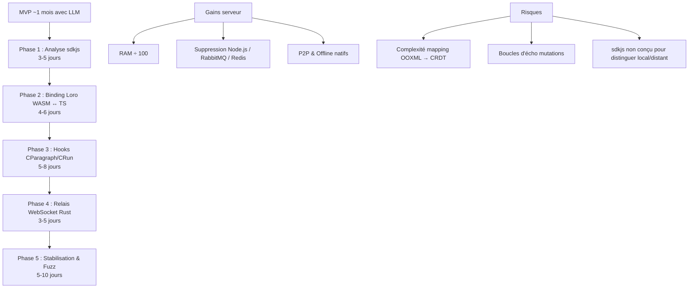

# Synthèse : Fusionner Loro (CRDT) avec ONLYOFFICE/EuroOffice

## Table des matières

1. [Pourquoi LibreOffice ne sera jamais pixel-perfect sur OOXML](#1-libreoffice-vs-onlyoffice--lécart-architectural-irréductible)
2. [Injecter du CRDT dans EuroOffice : faisabilité](#2-injecter-du-crdt-dans-eurooffice)
3. [Comment Microsoft 365 gère le problème](#3-larchitecture-de-microsoft-365)
4. [Fluid Framework (Microsoft, open source)](#4-fluid-framework)
5. [Comparatif des frameworks CRDT](#5-comparatif-des-frameworks-crdt)
6. [Pourquoi Loro est le meilleur candidat](#6-loro--le-candidat-idéal)
7. [Architecture de fusion Loro + ONLYOFFICE (sdkjs)](#7-fusion-loro--onlyoffice)
8. [Structure interne de sdkjs et pipeline de mutations](#8-anatomie-de-sdkjs)
9. [Estimation des délais avec assistance LLM](#9-délais-avec-assistance-llm)
10. [Faut-il tout réécrire en C++/WASM ?](#10-réécriture-c--wasm)
11. [Autres moteurs bureautiques libres](#11-autres-moteurs-libres)
12. [Mémoire : Fugue + Eg-walker de Loro](#12-performance-mémoire-de-loro)
13. [Serveur relais Rust + persistance](#13-serveur-relais-rust)
14. [Mode P2P (pair-à-pair)](#14-mode-p2p)
15. [Gestion des conflits hors-ligne (train)](#15-conflits-hors-ligne)
16. [Panneau de révision visuelle](#16-panneau-de-révision)
17. [Format ODT et ECMA-376](#17-odt-et-ecma-376)

---

## 1. LibreOffice vs ONLYOFFICE : l'écart architectural irréductible

L'écart de fidélité OOXML entre les deux n'est **pas un problème de bugs** mais une **divergence architecturale profonde** :

| | ONLYOFFICE | LibreOffice |
|---|---|---|
| **Modèle interne** | OOXML natif (ECMA-376) — **zéro conversion** | ODF (OpenDocument) — **traduction à chaque ouverture/sauvegarde** |
| **Rendu** | Canvas HTML5 côté client | Moteur Writer C++ (règles ODF) |
| **Héritage** | Conçu en 2012 pour OOXML | StarOffice années 1990, codebase 10M+ lignes C++ |

**4 chantiers titanesques** seraient nécessaires pour rendre LibreOffice pixel-perfect :
1. **Layout Engine** — Réécrire le moteur de mise en page (césure, spacing collapse, floating tables) → nécessiterait un double moteur (ODF + émulation Word)
2. **DrawingML** — Mapper 100% des primitives vectorielles Microsoft sur le sous-système svx/vcl
3. **Métriques de polices** — Émuler DirectWrite/GDI dans VCL (micro-variations de fraction de pixel → effet cascade sur la pagination)
4. **Modes de compatibilité Word** — Gérer les matrices `compatSetting` de Word 2007→M365

> [!IMPORTANT]
> **Estimation** : 3 à 5 ans × 15-20 ingénieurs C++ seniors = **plusieurs millions d'euros**. Et ce n'est pas l'objectif de The Document Foundation (mission = promouvoir ODF).

---

## 2. Injecter du CRDT dans EuroOffice

**Nettement plus réaliste** que de rendre LibreOffice pixel-perfect.

Le moteur de rendu OOXML natif resterait intact. Le chantier = remplacer la co-édition centralisée (Node.js + RabbitMQ) par un CRDT (Yjs, Automerge ou Loro).

**Effort estimé** : ~1-2 ans pour 3-5 ingénieurs systèmes distribués (vs 10-20 ingénieurs C++ sur plusieurs années pour LibreOffice).

### Ce que le CRDT règle vs ce qui consomme toujours de la RAM

| CRDT supprime ✅ | Toujours en RAM ⚠️ |
|---|---|
| Sessions Node.js lourdes par onglet | Parsing/désérialisation XML des gros fichiers |
| Verrous de blocs | Moteur de conversion PDF/Print |
| Files RabbitMQ pour l'arbitrage | Recalcul des formules complexes |
| | Reconstruction du fichier OOXML à la fermeture |

---

## 3. L'architecture de Microsoft 365

Microsoft résout le problème via **4 mécanismes propriétaires** :

1. **Protocole Cobalt (MS-FSSHTTPB)** — Le fichier est découpé en fragments indexés par hash SHA-1. Le serveur ne remplace que le bloc modifié, jamais le ZIP entier.
2. **Fluid Framework / OT** — Le serveur = simple séquenceur de messages (Total Order Broadcast). Le client porte le calcul.
3. **Write-Behind Buffering** — Le .docx n'est **jamais reconstruit en temps réel**. Les modifications s'empilent dans un journal de transactions. La reconstruction physique du ZIP est déléguée à des workers asynchrones (fermeture ou téléchargement).
4. **Co-moteur natif C++** — Les services web reposent sur le cœur C++ historique de MS Office, mutualisé via Copy-on-Write mémoire.

---

## 4. Fluid Framework

**Open source MIT, auto-hébergeable** (serveur Routerlicious en Node.js + Redis).

Paradigme **« Smart Clients, Dumb Server »** :
- Le serveur attribue un numéro d'ordre séquentiel et rediffuse. Il ne lit pas, ne comprend pas, ne valide pas.
- Les clients manipulent des **DDS** (SharedTree, SharedMap, SharedString) avec convergence déterministe.

> [!WARNING]
> Fluid **n'est pas une suite bureautique**. Pas d'UI, pas de gestion OOXML. Idéal pour Notion/Loop/Kanban, mais pas pour remplacer EuroOffice sans redévelopper un moteur de rendu complet.

---

## 5. Comparatif des frameworks CRDT

| Critère | **Yjs** | **Automerge** | **Loro** | **Fluid Framework** |
|---|---|---|---|---|
| **Noyau** | JS / Rust (Yrs) | Rust → Wasm | Rust → Wasm | TypeScript / C++ |
| **Philosophie** | Web & rich text | Local-First, historique Git | Haute perf, arbres mobiles | Haute échelle cloud |
| **Bindings éditeurs** | **Immense** (ProseMirror, Quill, Monaco, Slate, Lexical) | Modéré | En croissance | Orienté Microsoft/React |
| **Historique/Time-Travel** | Difficile sans snapshots | **Natif** (arbre de commits) | **Natif** (ultra-rapide) | Via journal d'opérations |
| **Arbres déplaçables** | ❌ | ❌ | ✅ **Natif** (Movable Trees) | Via SharedTree |
| **Licence** | MIT | MIT | MIT / Apache-2.0 | MIT |

**Verdict rapide** :
- Éditeur texte Web → **Yjs** (écosystème inégalé)
- Offline-First + historique → **Automerge** ou **Loro**
- Hiérarchies complexes (sections, calques) → **Loro**
- Widgets temps réel connectés → **Fluid**

---

## 6. Loro — Le candidat idéal

### Pourquoi Loro change la donne pour une suite bureautique

1. **Movable Tree CRDT natif** — Déplacement concurrent de sections/calques sans cycles orphelins
2. **Eg-walker + Lazy Loading** — 1,5M d'opérations chargées en **quelques millisecondes** ; fragments non affichés chargés à la demande
3. **Texte riche natif (Fugue CRDT)** — Styles (gras, italique, liens) intégrés directement dans LoroText sans entremêlement lors d'insertions concurrentes

### Horodatage et ordonnancement

Loro n'a **pas besoin de serveur** pour ordonnancer :
- **DAG + Horloges logiques** (Lamport Timestamps / Version Vectors)
- Chaque opération = `PeerID + Counter`
- Résolution déterministe via Fugue en cas de simultanéité stricte
- **Time Travel** natif avec horodatage réel optionnel

---

## 7. Fusion Loro + ONLYOFFICE

### Architecture cible

```
┌───────────────────────────────────────────────────────┐
│ NAVIGATEUR CLIENT                                      │
│  [ UI & Ruban ONLYOFFICE ] (web-apps)                  │
│        ↕                                               │
│  [ Moteur de rendu Canvas & Layout ] (sdkjs)           │
│        ↕  (Synchronisation bidirectionnelle)           │
│  [ Moteur CRDT Loro (Rust via WebAssembly) ]           │
│    • LoroTree (Sections, Tableaux, Paragraphes)        │
│    • LoroText (Texte enrichi avec spans de styles)     │
└──────────────────────┬────────────────────────────────┘
                       │ (Deltas binaires légers)
                       ▼
┌───────────────────────────────────────────────────────┐
│ SERVEUR RELAIS (Proxmox)                               │
│  • WebSocket apatride (~30 Mo)                         │
│  • Suppression totale de Node.js, RabbitMQ, Redis      │
└───────────────────────────────────────────────────────┘
```

### Point de greffe technique

1. **Désactiver** la pile réseau propriétaire du document-server
2. **Binding TypeScript** entre les classes sdkjs (`CParagraph`, `CRun`, `CTable`) et les conteneurs Loro (`LoroText`, `LoroTree`, `LoroMap`)
3. **Interception** : `InsertText()` → `loroDoc.getText().insert()` ; delta distant → `doc.Recalculate()` / `Draw()`

### Défis majeurs

| Défi | Complexité |
|---|---|
| Génération du document initial (premier .docx → LoroDoc) | Moyenne |
| Boucles d'écho (mutation distante → ré-émission Loro) | Classique (flags) |
| Mapping des structures OOXML complexes (DrawingML, styles imbriqués) | **Élevée** |
| Licence (AGPLv3 d'ONLYOFFICE + MIT de Loro → résultat AGPLv3) | Juridique |

---

## 8. Anatomie de sdkjs

### Arborescence

```
sdkjs/
├── common/        # Moteurs partagés (Drawing, Shapes, DocxFormat, Fonts)
├── word/          # Moteur .docx (document/, drawing/, api/)
├── cell/          # Moteur .xlsx (model/, view/, src/)
└── slide/         # Moteur .pptx (model/, view/)
```

### Modèle objet (DOM interne calqué 1:1 sur ECMA-376)

`CDocument` → `CSection` → `CParagraph` / `CTable` → `CRun` / `CSpan` → `CDrawing`

### Pipeline de mutation en 5 étapes

1. **Action Command** — Encapsulation (Undo/Redo Manager)
2. **Mutation DOM** — Modification du `CRun` au curseur (split si changement de style)
3. **Dirty Flags** — `paragraph.m_bIsDirty = true` (invalide seulement la zone modifiée)
4. **Recalcul Layout** — Métriques de polices → césure → Word Wrap → repagination
5. **Rendu Canvas** — `ctx.fillText`, `ctx.drawImage`, `ctx.bezierCurveTo`

> [!TIP]
> **Point d'ancrage Loro** : intercepter entre l'étape 1 et 2. Hooker `Api.CreateParagraph()`, `para.AddText()`, `run.SetBold()` pour alimenter Loro, et écouter `loroDoc.subscribe()` pour appliquer les deltas distants + forcer `Recalculate()`.

---

## 9. Délais avec assistance LLM

| Phase | Durée (avec LLM) |
|---|---|
| Analyse & extraction du SDK | 3-5 jours |
| Binding WASM & pont de données | 4-6 jours |
| Interception des frappes et du style | 5-8 jours |
| Relais WebSocket & résolution des boucles | 3-5 jours |
| Débogage cas limites & stabilisation | 5-10 jours |
| **Total MVP** | **~1 mois** (vs 3-6 mois sans LLM) |

### Ce que les LLMs accélèrent (×5 à ×10)
- Génération du boilerplate FFI/WASM
- Reverse engineering du code JS non-typé de sdkjs (fichiers de 4000 lignes)
- Suites de tests de fuzzing

### Ce qui reste incompressible
- **Mental Model Mapping** — Correspondance curseurs Canvas ↔ index UTF-8 Loro
- **Echo Problem** — Isoler mutations locales vs distantes dans un moteur non conçu pour ça
- **Hallucinations LLM** sur les fonctions internes non documentées de sdkjs

---

## 10. Réécriture C++ / WASM

> [!CAUTION]
> **Piège de la "Great Rewrite"**. sdkjs = 800 000+ lignes JS accumulées sur 15 ans. Réécriture totale = 2-3 ans pour retrouver la parité fonctionnelle.

### Pourquoi JS/V8 n'est pas le vrai problème

- Le JIT TurboFan de V8 compile en assembleur natif → écart CPU réel JS vs C++ = **seulement ×1.5-2** (imperceptible pour une frappe clavier : 0.5ms → 0.2ms)
- Le vrai coût du client lourd = **Chromium/CEF** (~150-250 Mo de RAM au lancement), pas sdkjs

### WASM ↔ Canvas = surcoût caché

- WASM ne peut pas manipuler directement `<canvas>` sans pont JS (wasm-bindgen)
- Pour être performant : compiler aussi Skia/WebGPU dans le WASM → +15-30 Mo de bundle

### Stratégie pragmatique = approche hybride

| Garder en JS/TS | Déléguer à Rust/WASM |
|---|---|
| Layout & rendu Canvas | Moteur CRDT (Loro) |
| Manipulation de la scène graphique | Dézippage/parsing XML (quick-xml) |
| | Moteur de calcul formules tableur (SIMD) |

---

## 11. Autres moteurs libres

| Projet | Stack | Particularité |
|---|---|---|
| **Univer** | TypeScript + Canvas/WebGL | Architecture modulaire moderne type Google Workspace |
| **Calligra** (KDE) | C++ / Qt | Moteur vectoriel modulaire, ODF natif |
| **Gnumeric / AbiWord** | C / GTK / Cairo | Calcul en virgule flottante plus rigoureux qu'Excel |
| **HyperFormula** | TypeScript (headless) | Moteur de calcul pur (~400 formules Excel) |
| **Typst** | Rust → WASM | Mise en page instantanée, alternative à LaTeX |
| **BlockSuite** (AFFiNE) | TypeScript + Rust (Yjs) | Local-First orienté blocs, CRDT natif dès le départ |

**Univer** utilise de l'OT (Operational Transformation) par défaut, pas du CRDT. Des bindings Yjs existent via plugin. Support XLSX bon, DOCX basique, PPTX rudimentaire.

---

## 12. Performance mémoire de Loro

### Fugue — Réduction de la fragmentation

- 50 caractères consécutifs = **1 seul bloc vectoriel** (PeerID, Range 0..50, String) au lieu de 50 nœuds
- Les blocs restent compactés grâce aux propriétés mathématiques de Fugue

### Eg-walker — Séparation DocState vs OpLog

- **DocState** (état actuel compact) en RAM ← seul chargé à l'ouverture
- **OpLog** (journal des opérations compressé) sur disque ← chargé à la demande pour Time Travel/Diff
- Retour arrière = parcours delta via LCA dans le DAG, pas de rejeu intégral

| Métrique (1M opérations) | CRDT standard (JS) | Loro (Rust) |
|---|---|---|
| RAM en mémoire | 300-800 Mo | **15-40 Mo** |
| Temps d'initialisation | Plusieurs secondes | **< 15 ms** |
| Taille fichier sérialisé | 40-80 Mo | **1-3 Mo** |
| Time Travel | Recalcul complet | **Instantané** |

### Empreinte LoroDoc côté serveur (Rust natif)

| Type de document | RAM LoroDoc |
|---|---|
| Courrier (2 pages) | < 150 Ko |
| Rapport (30 pages) | ~800 Ko à 1.5 Mo |
| Document massif (300 pages, 1M frappes) | ~15-35 Mo |

### Empreinte totale côté client (navigateur)

| Composant | RAM |
|---|---|
| Runtime navigateur / V8 | ~150-250 Mo |
| DOM interne sdkjs | ~80-200 Mo |
| Buffer Canvas 2D / WebGL | ~30-80 Mo |
| **Moteur Loro WASM** | **~15-40 Mo** |
| **Total** | **~300-600 Mo par onglet** |

### Gain côté serveur : Simplification et Décentralisation

| | ONLYOFFICE classique (Document Server) | Relais Rust + LoroDoc |
|---|---|---|
| RAM / document moyen | ~13-20 Mo | **~1-2 Mo** |
| RAM 100 docs actifs | ~1.5 - 2 Go | **~150-300 Mo** |
| Empreinte infrastructure | Lourde (Node, RabbitMQ, Redis, DB) | **~15-30 Mo** (Statique) |
| Mode Hors-ligne / P2P | **Impossible** | **Natif** |


> [!IMPORTANT]
> **Verdict** : Fusionner le moteur de rendu pixel-perfect d'ONLYOFFICE avec le CRDT Loro est **l'approche technique la plus élégante et réaliste** pour une suite bureautique souveraine Local-First. Le gain ne se mesure pas seulement en Mo gagnés, mais dans la **simplification radicale de l'infrastructure** (suppression de Node.js, RabbitMQ, Redis) et l'apport de capacités inédites : **fonctionnement offline natif et collaboration P2P**, impossibles avec le serveur officiel.

> **Rappel sur la performance native d'ONLYOFFICE :**
> *"OnlyOffice is one of the best, if not the best online office integrations for NextCloud, because the rendering of the document editor is done client-side, meaning as a rule of thumb, a server can support 75 connections per gigabyte of RAM. This is impressive compared to Collabora Office, which begins to struggle with connections far before this threshold, with the same level of connections. Also, OnlyOffice provides full compatibility with Microsoft Office document formats, compared to Collabora Office, which is based on LibreOffice Online.*
>
> *Based on OnlyOffice’s recommendations for the paid version of their software (which is identical to the open source version running in single node mode), a server with 4 GB of RAM and 4 CPU cores can easily support 200 to 400 concurrent users. If you need to scale OnlyOffice horizontally beyond two nodes using a load balancer and shared database backend, we provide custom consulting for more than 400 users with the OnlyOffice Community edition."*
> — [Autoize : Building ONLYOFFICE Document Server from source](https://autoize.com/building-onlyoffice-document-server-from-source/)


---

## 13. Serveur relais Rust

### Architecture minimale (Axum/Tokio)

- **DashMap** thread-safe : `doc_id → broadcast::Sender<Bytes>`
- Chaque client = 2 tâches Tokio (envoi + réception)
- Auto-nettoyage quand `receiver_count() == 0`

### Worker de persistance

Deux stratégies possibles :

#### Option A : Relais pur apatride (< 1 Mo/doc)
- Le serveur **append** les deltas bruts dans un fichier `.log` — zéro CPU, zéro désérialisation
- Le **client** génère le snapshot final et le pousse à Seafile

#### Option B : Worker LoroDoc natif côté serveur
- Le serveur instancie un `LoroDoc` Rust par document actif
- Flush débounced (5s après dernière frappe, ou max 60s)
- Écriture atomique (.tmp → rename)
- RAM variable selon taille du document (voir tableau ci-dessus)

### Résilience en cas de crash navigateur (Option A)

```
[ Nouveau client ouvre le document ]
  ├──► 1. Télécharge le dernier snapshot Seafile (version T-10 min)
  └──► 2. Télécharge le fichier brut deltas.log du serveur
           └──► doc.import(snapshot); doc.import(deltas_log);
                // Rejeu et fusion en ~2 ms → Document 100% à jour
```

Propriétés CRDT qui garantissent l'intégrité :
- **Idempotence** : réimporter un delta déjà connu = aucun effet
- **Commutativité** : l'ordre d'arrivée n'importe pas
- **Causalité** : chaque delta porte `PeerID + Counter`

### Dockerisation

Contrairement à Grommunio (multi-daemons, systemd, sockets UNIX → LXC dédié), le relais Rust est **parfait pour Docker** :
- Binaire unique statique (musl) ~15 Mo
- Image `FROM scratch`, 10 Mo RAM au démarrage
- Zéro dépendance système

---

## 14. Mode P2P

Le client **peut lui-même être serveur** grâce aux propriétés des CRDT :

### Dans le navigateur
- **WebRTC DataChannels** — Canaux directs chiffrés E2E
- Seul prérequis : signaling initial (ICE/SDP) pour traverser NAT/STUN

### En réseau local (client lourd)
- **mDNS / Bonjour** — Découverte automatique sur le même Wi-Fi/Ethernet
- Socket TCP/WebSocket local direct

### Modèle hybride recommandé
1. **P2P prioritaire** si même sous-réseau (mDNS)
2. **Repli sur relais Rust** si distants ou pare-feux stricts
3. Bascule automatique transparente pour l'utilisateur

> [!NOTE]
> Limite : efficace jusqu'à ~10-15 collaborateurs simultanés. Au-delà, la bande passante montante des postes sature (topologie mesh N×N).

---

## 15. Conflits hors-ligne

### Scénario du train

| Cas | Résultat Loro |
|---|---|
| **Parties différentes** (90% des cas) | Fusion instantanée et propre |
| **Même phrase** (insertions concurrentes) | Fugue juxtapose de manière déterministe, **jamais d'entremêlement** de lettres |
| **Propriété unique** (couleur, style) | **Last-Write-Wins** par horloge logique Lamport |
| **Déplacement structurel cyclique** (Section 2 → Chapitre A et Chapitre A → Section 2) | LoroTree détecte le cycle, priorité par ID de transaction, **l'arbre ne casse jamais** |

> [!TIP]
> Si la fusion automatique donne un résultat sémantiquement étrange, l'historique DAG permet de surligner visuellement les zones modifiées hors-ligne et de restaurer n'importe quelle version antérieure.

### Comparaison avec Office 365

| | Microsoft 365 (Cobalt) | Loro (CRDT) |
|---|---|---|
| Résolution conflits texte | **Manuelle** (modale UI) | **Automatique** (Fugue) |
| Fichiers `_conflit.docx` | Fréquents | **Impossibles** par conception |
| Fonctionnement P2P | Impossible | Natif |
| Infrastructure | Gros clusters serveurs | Relais apatride < 10 Mo |

---

## 16. Panneau de révision

Stratégie : **mapper les deltas distants Loro sur le Track Changes natif d'ONLYOFFICE** (déjà présent dans sdkjs).

- `CParagraph.AddTrackChangeInsert(userId, userName, timestamp, text)` → insertion souligné + couleur auteur
- `CParagraph.AddTrackChangeDelete(userId, userName, timestamp, text)` → suppression barré + couleur auteur
- Si l'utilisateur clique « Rejeter » → `loroDoc.getText().delete()` → delta propagé à tous les pairs

### Diff visuel entre deux versions

```typescript
// Fork léger (Copy-on-Write WASM)
const docA = doc.fork(); docA.checkout(versionA);
const docB = doc.fork(); docB.checkout(versionB);
// → Calcul du diff → spans "added" / "deleted" / "unchanged"
// → Rendu HTML <ins class="diff-added"> / <del class="diff-deleted">
```

Zéro requête serveur, exécution en < 2 ms.

---

## 17. ODT et ECMA-376

### Support ODT dans ONLYOFFICE

ONLYOFFICE supporte l'**ouverture, édition et sauvegarde** en ODT/ODS/ODP. Sous le capot : **conversion transparente ODT → modèle interne OOXML → ODT**.

Le mapping passe par un transpilateur sémantique :
- `<text:p>` → `<w:p>` → `CParagraph`
- `<text:span>` → `<w:r>` → `CRun`
- Conversion d'unités : cm → DXA/EMU

> [!NOTE]
> **Impact pour Loro** : Il est inutile d'appliquer Loro sur le XML ODT brut. Loro se synchronise avec le modèle sdkjs **après** conversion. L'utilisateur peut exporter indifféremment en .docx ou .odt.

### ECMA-376 : Strict vs Transitional

| | Transitional | Strict |
|---|---|---|
| Objectif | Rétrocompatibilité (VML autorisé) | Standard pur (DrawingML uniquement) |
| Usage MS Office | **Par défaut** | Optionnel |
| ONLYOFFICE | Généré par défaut | Supporté en lecture/écriture |

---

## Conclusion : feuille de route synthétique



